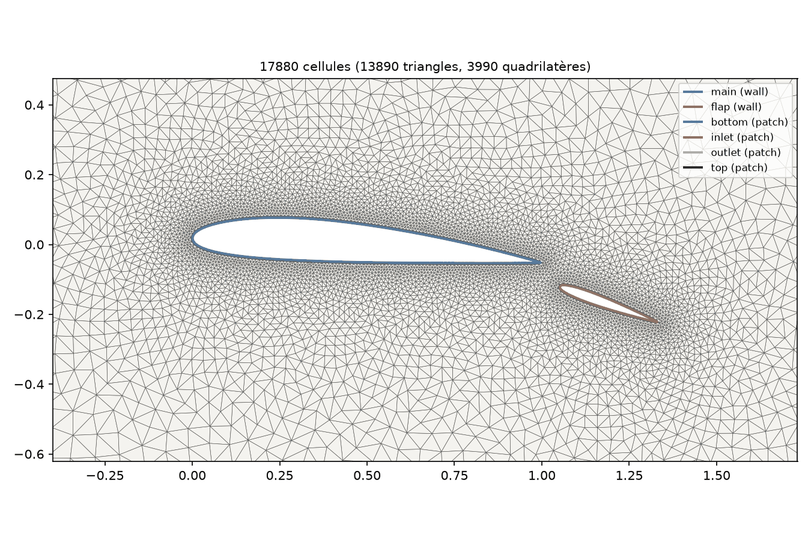
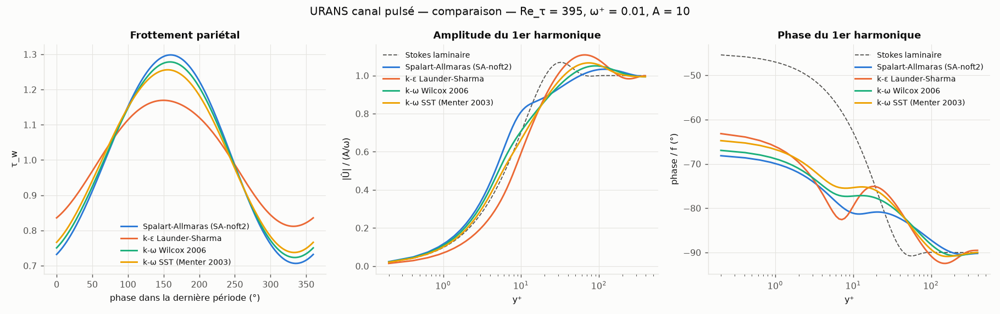

# microrans — micro-solveur RANS / URANS 1D et 2D

Code Python exécutable pour tester des modèles de turbulence **RANS** (stationnaire) et **URANS**
(instationnaire), avec un **mailleur 2D** intégré. Deux niveaux :

- **1D** : canal plan turbulent établi, intégré jusqu'à la paroi (rapide, < 0.5 s par calcul) ;
- **2D** : solveur volumes finis incompressible sur maillages non structurés (SIMPLE/PIMPLE),
  mailleur (structuré multi-blocs, O-grid, triangles, hybride couches limites), import/export
  de maillages et de géométries.

Les **mêmes classes de modèles** servent en 1D et en 2D (la physique n'est écrite qu'une fois) :

| Clé   | Modèle | Variante implémentée | Référence |
|-------|--------|----------------------|-----------|
| `sa`  | Spalart-Allmaras | forme « standard » NASA TMR, **SA-noft2** par défaut (option f_t2), limitation de S̃ (note c) | Spalart & Allmaras 1992 ; [TMR](https://turbmodels.larc.nasa.gov/spalart.html) |
| `ke`  | k-ε | **Launder-Sharma bas-Reynolds** (intégrable jusqu'à la paroi) | Launder & Sharma 1974 ; [TMR](https://turbmodels.larc.nasa.gov/ke-ls.html) |
| `kw`  | k-ω | **Wilcox 2006** (limiteur de contrainte, diffusion croisée) | Wilcox 2006/2008 ; [TMR](https://turbmodels.larc.nasa.gov/wilcox.html) |
| `sst` | k-ω SST | **Menter 2003** | Menter, Kuntz & Langtry 2003 ; [TMR](https://turbmodels.larc.nasa.gov/sst.html) |
| `laminar` | aucun (ν_t = 0) | vérification, écoulements laminaires | — |

> **Ce que c'est :** un banc d'essai compact, vérifié contre des solutions exactes et validé sur
> quelques cas de référence publiés, et une base propre à étendre.
>
> **Ce que ce n'est pas :** un remplaçant d'OpenFOAM, SU2 ou Fluent. C'est du Python pur
> (numpy/scipy) : quelques milliers à quelques dizaines de milliers de cellules, écoulements
> **incompressibles**, **2D** uniquement, pas de parallélisme.

---

## Installation

```bash
pip install -e ".[test]"        # ou : pip install -r requirements.txt
```

Python ≥ 3.10 ; numpy, scipy, matplotlib (pytest pour les tests). `pyamg` est utilisé s'il est
installé (option `solver_p = "amg"`), sinon factorisation LU creuse.

## Commandes

```bash
# --- 1D (canal plan) ---
microrans rans -m all                       # RANS, 4 modèles, Re_τ = 395
microrans urans -m sst --omega-plus 0.04    # canal à gradient de pression pulsé
microrans verify                            # vérification 1D (solutions exactes)

# --- maillage 2D ---
microrans mesh --preset cylinder-hybrid -f msh su2 vtk foam
microrans mesh cases/mesh_naca_multi.toml             # profil + volet importé (.dat)
microrans mesh cases/mesh_cylindre_hybride.toml --type unstructured

# --- calcul 2D ---
microrans run2d cases/cavite_re100.toml               # cavité entraînée (Ghia)
microrans run2d cases/cylindre_re20.toml              # cylindre stationnaire
microrans run2d cases/cylindre_re100_urans.toml       # lâcher de tourbillons (URANS)
microrans run2d cases/plaque_plane_sa.toml            # plaque plane turbulente
microrans run2d cases/plaque_plane_sa.toml --set physics.model=\"sst\" solver.max_iter=3000
```

(`python -m microrans ...` est équivalent sans installation.)

---

# Partie 2D

## Mailleur

Inspiré de blockMesh/snappyHexMesh (OpenFOAM), Gmsh et des « inflation layers » de Fluent.

**Objets (géométrie CSG)** : `circle`, `rectangle` (un nom de patch par côté), `ellipse`,
`polygon`, `naca` (4 chiffres, répartition en cosinus), `spline` (courbe fermée lisse), `file`
(contour importé). Opérations booléennes union `|`, différence `-`, intersection `&` ;
transformations `angle` (rotation), `incidence` (angle d'attaque, nez vers le haut), `scale`,
`translate`. Le nom d'un objet devient le nom de son patch de frontière.

**Formats de contours importés** : `.dat`/`.txt` (profils Selig ou Lednicer, ou colonnes x y),
`.csv`, `.svg` (polygon, polyline, rect, circle, ellipse, path M/L/H/V/C/Q/Z), `.dxf` ASCII
(LWPOLYLINE, POLYLINE, LINE, ARC, CIRCLE ; segments chaînés en contours fermés).

**Types de maillage** (`[mesh] type = ...`) :

| Type | Principe | Usage |
|------|----------|-------|
| `rectangle` / `blocks` | structuré multi-blocs à la blockMesh : sommets, blocs, progression (`grading`, multi-grading), arêtes courbes (arc, polyligne, spline), interpolation transfinie, recollement des blocs | canaux, cavité, marche, plaque plane |
| `ogrid` | structuré en O autour d'un corps, 1re maille imposée (y⁺), raccord progressif à un cercle de champ lointain | cylindre, profils |
| `unstructured` | triangles (algorithme DistMesh, Persson & Strang 2004), raffinement par distance aux objets et par zones | géométries quelconques, multi-corps |
| `hybrid` | couches de quadrilatères extrudées aux parois + triangles, raccord conforme | RANS autour de corps complexes |
| `file` | lecture d'un maillage existant | maillages Gmsh / SU2 |

**Formats de maillage** : Gmsh `.msh` (lecture v2.2 et v4.1 ASCII, écriture v2.2 ; groupes
physiques = patches), SU2 `.su2` (lecture/écriture), VTK `.vtk` (ParaView, avec champs),
**OpenFOAM** `constant/polyMesh` (extrudé d'une maille, faces avant/arrière `empty`, paires
périodiques en `cyclic`).

**Qualité** (à la `checkMesh`) : non-orthogonalité, asymétrie, rapport d'aspect, types de cellules ;
avertissements au-delà des seuils usuels. Structure de données « à la OpenFOAM » : faces
internes d'abord (owner < neighbour), puis faces frontières groupées par patch ; patches `wall`,
`patch`, `symmetry`, `empty` ; périodicité par translation convertie en faces internes.



## Solveur

- Volumes finis colocalisés, cellules polygonales quelconques ; gradients de Green-Gauss ;
  correction non orthogonale (limitée, boucles de correction sur la pression).
- Couplage vitesse-pression : **SIMPLE / SIMPLEC** (stationnaire) et **PIMPLE** (instationnaire,
  Euler implicite ou BDF2 « backward », correction ddtCorr), interpolation de Rhie-Chow sous sa
  forme OpenFOAM (HbyA, φHbyA).
- Convection : `upwind` ou `linearUpwind` (correction différée) ; forme « bounded » en stationnaire.
- Conditions aux limites physiques (à la SU2) : `wall` (option paroi mobile), `inlet` (U constante
  ou expressions en x, y), `outlet` (p imposée), `symmetry` (glissement), `farfield` (U∞/p∞ selon
  le sens de l'écoulement) ; périodicité via le maillage.
- Turbulence : les classes 1D sont réutilisées telles quelles (même code) avec des opérateurs 2D.
  Distance à la paroi exacte (segments), ω pariétal de Menter avec la distance du 1er centre.
- Sorties : `summary.json` (convergence, Cd, Cl, y⁺ pariétal, Strouhal), `history.csv`,
  `fields.vtk` (ParaView), figures (|U|, p, vorticité, ν_t/ν, maillage, convergence, efforts).

## Vérification et validation 2D (résultats obtenus avec ce code)

| Cas | Grandeur | microrans | Référence |
|-----|----------|-----------|-----------|
| Poiseuille périodique | ordre de convergence en espace | 2.0 | 2 (solution exacte) |
| Womersley (canal, forçage oscillant) | ordre en temps Euler / BDF2 | 1.0 / 2.0 | 1 / 2 ; mêmes erreurs que le solveur 1D à 3 chiffres |
| Canal entrée/sortie laminaire | profil de sortie | écart ≤ 0.4 % du max | parabole exacte |
| Cavité entraînée Re = 100, 64×64 | profils u(0.5, y), v(x, 0.5) | écart max 0.004 / 0.009 | Ghia, Ghia & Shin (1982) |
| Cylindre Re = 20, O-grid 96×64 et 160×96 | C_d | 2.037 / 2.033 | 2.045 (Dennis & Chang 1970) |
| Cylindre Re = 20 | longueur de recirculation L/D | ≈ 0.90–0.91 (estimation grossière) | 0.94 (Dennis & Chang 1970) |
| Cylindre Re = 100 (URANS laminaire), 96×64, Δt = 0.05 | St ; C_d moyen ; amplitude C_l | 0.160 ; 1.354 ; 0.39 | 0.164–0.167 ; 1.32–1.35 ; ≈ 0.33 (simulations 2D publiées) |
| Canal turbulent périodique Re_τ = 395, SA | U_b | 17.6402 | 17.6398 (solveur 1D, même modèle) |
| Plaque plane turbulente Re_L = 5e6 (géométrie NASA TMR), SA | C_f à x = 0.97 | 0.00273 | 0.00273 (Schultz-Grunow) ; 0.00287 (White) |
| idem, SST | C_f à x = 0.97 | 0.00260 | idem |

Commentaires honnêtes :
- **Cylindre Re = 100** : sur ce maillage grossier, St est ~2–3 % trop bas et l'amplitude de C_l
  ~20 % trop haute ; ce sont des écarts de résolution typiques, pas une validation fine.
- **Canal 2D, SST / k-ω / k-ε** : écart de 1 à 1.6 % avec le 1D à 96 cellules, qui se réduit quand
  on raffine (SST : 17.557 → 17.402 → 17.346 pour 96 → 192 → 384 cellules, contre 17.291 en 1D
  très fin). C'est la sensibilité à y⁺ déjà observée en 1D (voir plus bas), pas une différence
  d'équations.
- **Plaque plane SST** : C_f 5 % sous les corrélations sur ce maillage (y⁺ du 1er centre ≈ 0.5–0.9),
  alors que SA tombe sur Schultz-Grunow. Non investigué davantage : probablement la sensibilité de
  la condition pariétale sur ω à la résolution. Les corrélations de C_f sont elles-mêmes à
  quelques % près.


---

# Partie 1D (canal plan)

## Physique

Canal plan de demi-hauteur h, parois en y = 0 et y = 2h, écoulement établi :

```
∂U/∂t = f(t) + ∂/∂y[(ν + ν_t) ∂U/∂y],     f = −(1/ρ) ∂p/∂x
```

**Adimensionnement :** longueurs en h, vitesses en u_τ nominale (f moyen = 1), temps en h/u_τ,
ν = 1/Re_τ. En stationnaire, le bilan impose exactement τ_w = f·h = 1 (contrôle intégré).
**Cas URANS :** f(t) = 1 + A sin(ωt), ω = ω⁺ Re_τ ; départ de la solution RANS, ~80 h/u_τ de
transitoire, puis moyennes de phase et 1er harmonique (référence : couche de Stokes laminaire).

## Numérique

- Volumes finis aux noeuds, maillage en tanh (y1⁺ imposé), ordre 2 (vérifié).
- **Termes sources linéarisés par Newton** (jacobienne locale implicite, partie explicite ≥ 0) :
  indispensable, une linéarisation « Picard » des puits quadratiques (βω², C₂ε̃²/k,
  c_w1 f_w (ν̃/d)²) oscille (période 2) aux grands pas de temps.
- RANS : pseudo-temps (Euler implicite, Δτ = 5) + **sous-relaxation 0.5** de la turbulence (le
  couplage U ↔ ν_t se comporte comme x ↦ a/x). Convergence jusqu'à ~1e-13 de Re_τ = 180 à 5200.
- URANS : Euler ou **BDF2**, sous-itérations avec prédicteur linéaire.

## Vérification 1D (`microrans verify`)

| Cas | Ordre observé | Attendu |
|-----|---------------|---------|
| Diffusion à coefficient variable, solution manufacturée, maillage étiré | 1.99 → 2.00 | 2 |
| Womersley laminaire, temps, Euler implicite | 0.98 → 0.99 | 1 |
| Womersley laminaire, temps, BDF2 | 1.96 → 1.99 | 2 |
| Womersley laminaire, espace | 1.86 → 2.01 | 2 |
| Poiseuille laminaire | erreur 1e-15 | — |

## Résultats 1D (192 mailles, y1⁺ = 0.2)

| Modèle | U_b⁺ Re_τ = 395 | écart Dean | U_b⁺ Re_τ = 5200 | écart Dean |
|--------|-----------:|-----------:|------------:|-----------:|
| SA     | 17.63 | +2.5 % | 23.80 | −4.3 % |
| k-ε LS | 18.68 | +8.6 % | 24.55 | −1.2 % |
| k-ω 06 | 17.52 | +1.9 % | 24.34 | −2.1 % |
| SST    | 17.38 | +1.0 % | 23.89 | −3.9 % |

Dean (1978) est une corrélation empirique (quelques %) : ces écarts ne valident ni n'invalident
un modèle. Superposer un profil DNS avec `--reference` pour une vraie comparaison.

**Sensibilité au maillage (U_b⁺, Re_τ = 395)** :

| Maillage | SA | k-ε LS | k-ω 06 | SST |
|----------|---:|------:|------:|----:|
| 128 mailles, y1⁺ = 0.5 | 17.608 | 18.483 | 17.670 | 17.521 |
| 192 mailles, y1⁺ = 0.2 (défaut) | 17.629 | 18.683 | 17.523 | 17.375 |
| 1024 mailles, y1⁺ = 0.05 | 17.649 | 18.804 | 17.437 | 17.291 |

**URANS, canal pulsé (Re_τ = 395, ω⁺ = 0.01, A = 10)** : ⟨τ_w⟩ = 1.0000(4) pour tous les modèles
(bilan exact), amplitude du frottement oscillant 0.18 (k-ε) à 0.30 (SA) contre 0.253 pour la
couche de Stokes laminaire : les modèles divergent nettement, sans donnée LES/DNS incluse pour
trancher.




---

## Limites connues (à lire avant d'utiliser les résultats)

1. **Performances** : Python pur, solveurs linéaires directs par défaut (< 40 000 cellules).
   Ordres de grandeur mesurés : cavité 64×64 ≈ 12 s ; plaque plane SA (7 200 cellules) ≈ 30 s ;
   cylindre Re = 100 instationnaire (6 144 cellules, 4 000 pas) ≈ 7 min.
2. **SIMPLE converge lentement** sur les maillages très fins et étirés (modes lisses mal amortis
   par la sous-relaxation implicite) : ex. canal 2D à 384 cellules non convergé en 8 000
   itérations. Pas de multigrille ni de solveur couplé.
3. **Maillages non orthogonaux** (triangles, hybrides) : plus délicats pour SIMPLEC ; baisser
   `relax_U` (0.7) si le calcul diverge. Le mailleur hybride produit des cellules très asymétriques
   au bord de fuite aigu des profils (couches extrudées) ; l'O-grid y a une non-orthogonalité ~80°.
4. **Incompressible uniquement**, pas de loi de paroi (y⁺ ≲ 1 requis), pas de transition.
5. **k-ω / SST** : sensibilité notable à la hauteur de la 1re maille (condition pariétale de
   Menter), convergence ≈ ordre 1 en y1⁺ ; zone log atteinte lentement dans le canal.
6. Validation limitée aux cas du tableau ci-dessus ; pas de comparaison point à point avec les
   solutions de référence du NASA TMR (données non embarquées).
7. Le mailleur DistMesh est lent pour de gros maillages (≈ 30–45 s pour ~15 000 cellules).

## Pistes d'amélioration

- Multigrille (pyamg) par défaut, solveur couplé, parallélisation ; lois de paroi.
- Compressible (profils transsoniques), transition (γ-Re_θ), modèles SA-neg / SST-V.
- Comparaisons intégrées aux données NASA TMR / DNS ; C-grid pour profils ; mailleur en C++.

## Structure du code

```
microrans/
  grid.py, numerics.py, flow.py, solver.py, cases.py     solveur 1D (canal)
  models/          modèles de turbulence (communs 1D/2D) + linéarisation de Newton
  mesh2d/
    geometry.py    objets CSG, NACA, splines, transformations
    mesh.py        structure volumes finis (owner/neighbour, patches, périodicité, qualité)
    blocks.py      multi-blocs à la blockMesh (+ canal, cavité, marche, plaque plane)
    ogrid.py       maillage en O
    unstructured.py  DistMesh (triangles) et hybride couches limites
    io.py          Gmsh, SU2, VTK, OpenFOAM, contours dat/csv/svg/dxf
    builder.py     construction depuis un fichier de configuration, préréglages
    plot.py        tracés de maillages et de champs
  fv2d/
    fvm.py         opérateurs volumes finis, assemblage, solveurs linéaires
    solver.py      SIMPLE / SIMPLEC / PIMPLE, conditions aux limites, efforts
    case.py        fichiers de cas TOML/JSON, Strouhal, sorties
    benchmarks.py  données de référence (Ghia et al. 1982)
cases/             exemples de maillages et de calculs
tests/             pytest
```

**Ajouter un modèle de turbulence :** dériver `TurbulenceModel` (`models/base.py`) : définir
`variables`, `eddy_viscosity`, `update` (+ `initial_state` pour le 1D, `freestream_values` et
`wall_value` pour le 2D). Dans `update`, écrire chaque équation `∂φ/∂t + … = Q(φ) + ∇·(Γ∇φ)`,
passer `Q` et `dQ/dφ` à `linearize_source`, puis appeler `self._solve(step, nom, Γ, source, puits)`
et utiliser `self.ops.grad_sq` / `self.ops.grad_dot` et `flow.strain` / `flow.vorticity` pour les
gradients : le même code fonctionne alors en 1D et en 2D.
