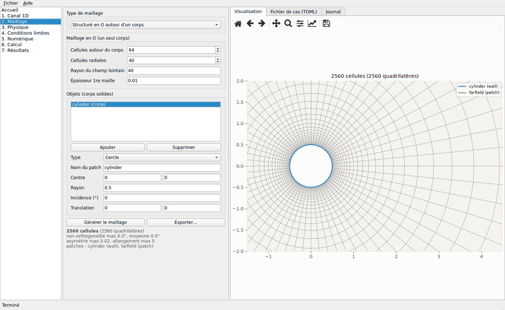
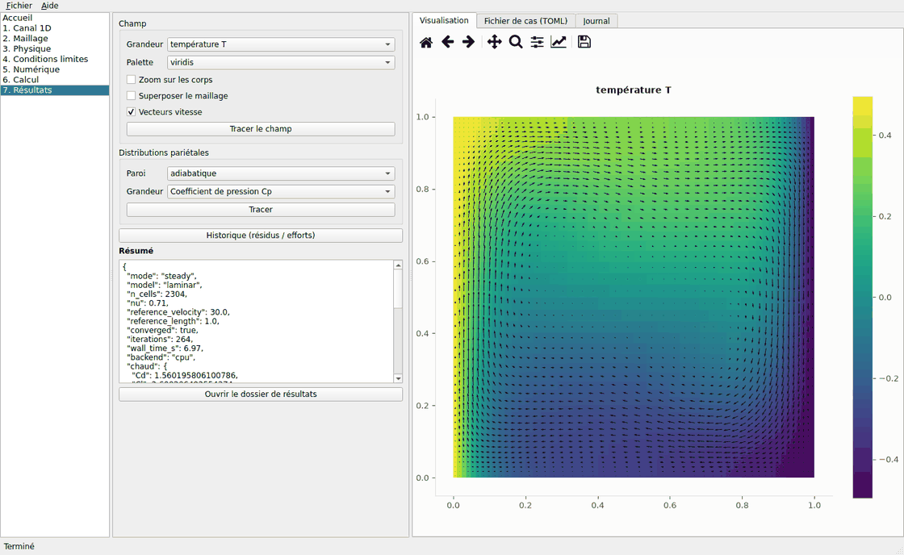
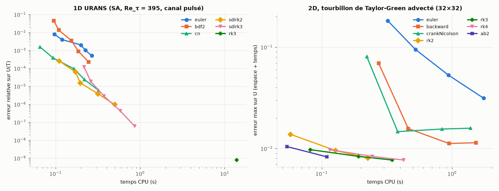
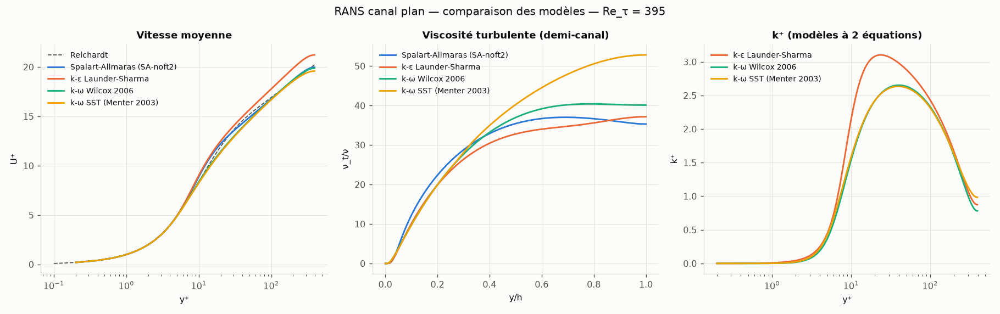
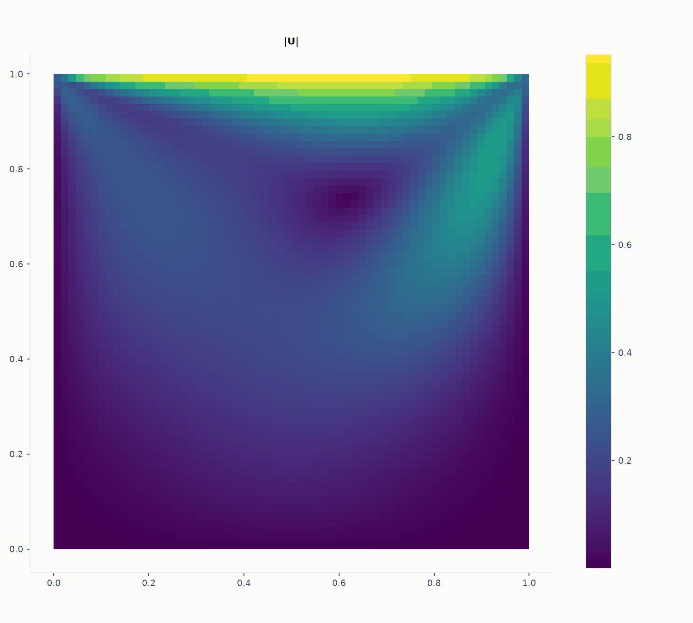
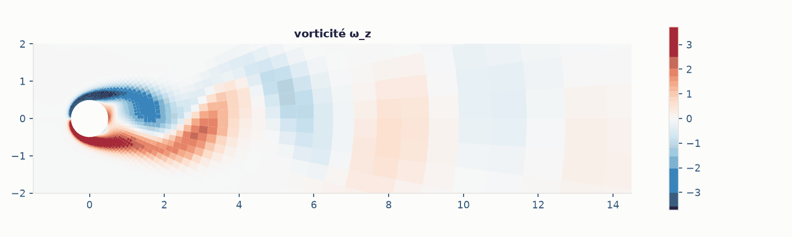
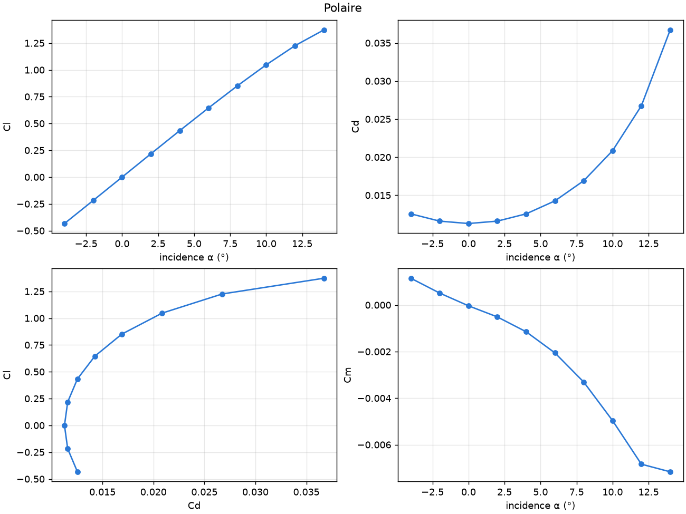
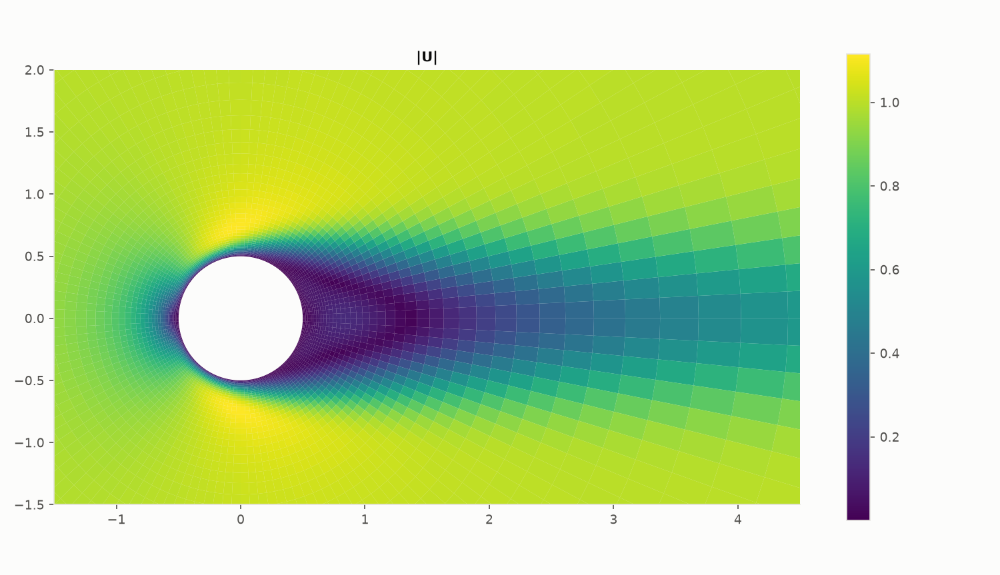

# microrans — simulation RANS / URANS 1D et 2D, avec mailleur et interface graphique

[](https://github.com/Kayoouu/Microrans/actions/workflows/tests.yml)
[](https://github.com/Kayoouu/Microrans/actions/workflows/build.yml)

Outil de simulation d'écoulements **incompressibles turbulents ou laminaires**, en Python :

- **2D plan ou axisymétrique** (tuyaux, jets, corps de révolution) : volumes finis sur
  maillages structurés, non structurés ou hybrides ; stationnaire (SIMPLE/SIMPLEC) et
  instationnaire (PIMPLE implicite ou Runge-Kutta explicite) ; thermique (convection forcée et
  naturelle, Boussinesq) ; scalaires transportés (concentration, polluant, âge du fluide) ;
  fluides non newtoniens (loi puissance, Carreau, Cross, Bingham, Herschel-Bulkley, Casson) ;
  zones poreuses (filtres, échangeurs : Darcy-Forchheimer, anisotropes) ; rotation propre
  (swirl) en axisymétrique et disques actuateurs (hélices, éoliennes, ventilateurs) ;
  polaires et balayages de paramètres ; reprise de calcul ; mailleur intégré et
  import/export Gmsh / SU2 / VTK / OpenFOAM ;
- **1D** : canal plan turbulent intégré jusqu'à la paroi (RANS et URANS pulsé), très rapide,
  idéal pour comparer les modèles ;
- **modèles de turbulence** : Spalart-Allmaras, k-ε (Launder-Sharma), k-ω (Wilcox 2006),
  k-ω SST (Menter 2003) — le même code sert en 1D et en 2D ; transition laminaire-turbulent
  (SST + γ de Menter 2015) ;
- **interface graphique** et **ligne de commande** partageant le même
  format de cas (TOML) ; calcul sur **CPU**, ou carte graphique NVIDIA / AMD / Intel
  (expérimental, à mesurer sur sa machine : `microrans devices`, `microrans bench`).

Les méthodes sont reprises des grands codes (OpenFOAM, Fluent, SU2) et **chaque choix numérique
est justifié par une mesure** reproductible dans ce dépôt (sections « Méthodes » et
« Validation »). Ce qui ne marche pas ou n'est pas démontré est écrit explicitement
(section « Limites »).

> **Ce que ce n'est pas :** un remplaçant d'OpenFOAM, SU2 ou Fluent. Python vectorisé
> (NumPy/SciPy) : confortable jusqu'à ~10⁵ cellules en 2D ; incompressible, 2D plan ou
> axisymétrique (pas de 3D), pas de transition ni de LES.

---

## 1. Démarrer sans rien installer (exécutable)

1. Télécharger l'archive de votre système :
   - onglet **Releases** du dépôt (versions étiquetées `v*`), ou
   - onglet **Actions → executables → dernier run → Artifacts** : `microrans-Windows`,
     `microrans-Linux` (compte GitHub requis). Pas d'exécutable macOS : sur Mac, installer
     la version Python (section 2), qui fonctionne à l'identique.
2. Décompresser, puis lancer **`microrans-gui`** (`microrans-gui.exe` sous Windows).
   Le même dossier contient **`microrans`**, la ligne de commande (double-cliqué sans
   argument, il ouvre aussi l'interface). En cas de problème, le journal
   `microrans_resultats/microrans-gui.log` (dossier personnel) indique la cause.

Honnêtement : les exécutables ne sont **pas signés**. Windows affiche un avertissement
SmartScreen (« Informations complémentaires → Exécuter quand même »). Le dossier pèse ~350 Mo
(Qt, SciPy, Matplotlib embarqués). Chaque archive est construite et testée automatiquement
(calcul en ligne de commande + auto-test de l'interface) sur les machines GitHub.

### Parcours dans l'interface

`Accueil` (exemples) → `1. Canal 1D` ou `2. Maillage` → `3. Physique` → `4. Conditions limites`
→ `5. Numérique` → `6. Calcul` (résidus / efforts en direct, boutons Arrêter et **Continuer
le calcul précédent**) → `7. Résultats`
(champs, vecteurs, Cp / Cf / y⁺ / flux de chaleur pariétaux, profils le long d'une ligne). L'onglet **Fichier de cas (TOML)**
montre le cas complet, modifiable : tout ce que les formulaires ne proposent pas (maillage
multi-blocs, zones de raffinement, expressions de vitesse) s'y écrit.




## 2. Installation Python

```bash
pip install -e ".[gui,test]"      # interface graphique + tests
pip install -e .                  # calcul seul (ligne de commande, API Python)
pip install -e ".[gpu]"           # + CuPy (carte NVIDIA + CUDA 12)
```

Python ≥ 3.10 ; NumPy, SciPy, Matplotlib, pyamg (+ PySide6 pour l'interface).

## 3. Ligne de commande

```bash
microrans gui                                   # interface graphique
microrans examples                              # liste des cas fournis
microrans run2d cavite_re100                    # calcul 2D (nom d'exemple ou fichier .toml)
microrans run2d plaque_plane_sa --set physics.model=sst --set solver.max_iter=3000
microrans run2d convection_naturelle_ra1e5
microrans run2d cylindre_re100_urans --set solver.time_scheme=rk3 --set solver.adjust_dt=true
microrans run2d cylindre_re100_urans --continue --set solver.t_end=200   # poursuivre un calcul
microrans run2d mon_cas_fin.toml --restart results/mon_cas/checkpoint.npz # partir d'un autre calcul
microrans polar naca0012_polaire --alpha -4 14 2      # polaire Cl(α), Cd(α), Cm(α)
microrans polar naca0012_polaire --alpha -4 14 2 -j 4 # idem, 4 points à la fois (4 cœurs)
microrans run2d sphere_re100_axisym                   # axisymétrique : sphère (2 s)
microrans run2d tuyau_thermique                       # tuyau chauffé, Nusselt local
microrans sweep cylindre_re20 --param physics.reynolds --values 10 20 40  # balayage
microrans mesh mesh_naca_multi -f msh su2 vtk foam   # mailler seulement, exporter
microrans mesh --preset cylinder-hybrid
microrans rans -m all                           # canal 1D, 4 modèles
microrans urans -m sst --scheme sdirk3          # canal 1D pulsé
microrans verify                                # vérification contre solutions exactes
microrans schemes -o docs                       # étude précision / coût des schémas en temps
```

Sorties d'un calcul 2D : `summary.json` (convergence, Cd, Cl, y⁺, Strouhal, Nusselt),
`history.csv`, `wall_<patch>.csv` (Cp, Cf, y⁺, T, flux), `fields.vtk` (ParaView), figures,
`checkpoint.npz` (sauvegarde pour reprise).

**Sauvegarde et reprise** : `checkpoint.npz` est écrit à la fin, à l'arrêt demandé et toutes
les 5 minutes (`[output] checkpoint_minutes`). Sur le **même maillage**, la reprise est
exacte (champs, flux aux faces, niveaux de temps de BDF2/AB2, Δt adaptatif, historique) :
un calcul interrompu puis repris donne un résultat identique au bit près (tests). Sur un
**autre maillage**, les champs sont interpolés (comme `mapFields` d'OpenFOAM) : cavité 128²
démarrée depuis une solution 32², 508 itérations au lieu de 1 135 (19 s au lieu de 45 s).
Changer de modèle de turbulence est possible (les variables absentes partent des valeurs
amont).

### Format de cas (TOML, extrait)

```toml
[mesh]                     # rectangle | blocks | ogrid | unstructured | hybrid | file
type = "hybrid"
h_max = 1.0
h_surface = 0.04
layers = { n = 12, first_height = 2e-3, ratio = 1.2 }
[[bodies]]
type = "naca"              # circle | rectangle | ellipse | naca | polygon | spline | file
code = "2412"
incidence = 4.0
name = "profil"
[physics]
reynolds = 1e6
model = "sst"              # laminar | sa | ke | kw | sst
angle_of_attack = 4.0      # incidence de l'écoulement amont (°) ; Cd, Cl en axes écoulement
axisymmetric = false       # true : x = axe, y = rayon ; frontière d'axe : type = "axis"
swirl = false              # axisymétrique : rotation propre u_θ (U_theta / omega aux frontières)
[physics.viscosity]        # optionnel : fluide non newtonien (laminaire)
model = "carreau"          # power_law | carreau | cross | herschel_bulkley | bingham | casson
nu0 = 5.33e-5
nu_inf = 3.29e-6
lambda = 3.313
n = 0.3568
[energy]                   # optionnel : thermique
Pr = 0.71
beta = 3.4e-3
[scalars.c]                # optionnel : scalaire transporté (autant que voulu)
diffusivity = 1e-3         # ou schmidt = Sc ; Sc_t = 0.7 ; source = 1 : âge du fluide
initial = 0.0              # scheme = "linearUpwindLimited" (défaut, borné) | linearUpwind
[[porous]]                 # optionnel : zone poreuse (autant que voulu)
region = "rectangle"       # rectangle (x0 x1 y0 y1) | circle (center, radius) | expression
x0 = 3.0
x1 = 4.0
y0 = 0.0
y1 = 1.0
darcy = 1000.0             # 1/m² (ou permeability = 1e-3 m²) ; [d1, d2] + angle : anisotrope
forchheimer = 10.0         # 1/m
[[actuator_disk]]          # optionnel : hélice / éolienne (poussée, couple)
x0 = -0.075
x1 = 0.075
radius = 1.0
thrust_coefficient = 0.5   # ou thrust = T (> 0 : pousse vers +x) ; torque = Q (avec swirl)
mode = "turbine"           # turbine | propeller
[boundary.inlet]
type = "inlet"             # wall | inlet | outlet | symmetry | farfield | axis | pressure_inlet
U = [1.0, 0.0]             # ou flow_rate = Q (débit ; profile = "uniform" | "parabolic")
scalars = { c = 1.0 }      # valeur imposée (défaut 0 en entrée, flux nul ailleurs)
# scalar_flux = { c = 0.1 } : flux entrant imposé (paroi)
# pressure_inlet : p0 = pression totale (p = p0 − ½|U|² en entrée)
[initial]
restart = "results/grossier/checkpoint.npz"   # optionnel : repartir d'un calcul
[solver]
mode = "transient"         # steady | transient
time_scheme = "auto"       # auto | euler | backward | crankNicolson | rk1..rk4 | ab2
dt = 0.01
t_end = 10.0
backend = "cpu"            # cpu | cuda | rocm | intel
fmg_levels = 0             # démarrage multigrille (stationnaire) : niveaux grossiers
[sweep]                    # optionnel : microrans sweep <cas>
parameter = "physics.angle_of_attack"
range = "-4:14:2"          # ou values = [0, 5, 10]
jobs = 1                   # points calculés en parallèle (0 = tous les cœurs)
[output]
moment_center = [0.25, 0.0]   # Cm autour du quart de corde
nusselt = "bulk"           # conduites : Nu local sur la température de mélange
probes = [[1.0, 0.0], [2.0, 0.5]]   # sondes : Ux, Uy, p à chaque itération (history.csv)
average_from = 50.0        # instationnaire : moyennes et écarts-types (Ux_mean, p_rms…)
animate = "vorticity"      # instationnaire : animation_vorticity.gif (~100 images)
[[output.lines]]           # profil le long d'une ligne : line_sillage.csv / .png
name = "sillage"
start = [1.0, -2.0]
end = [1.0, 2.0]
```

Axisymétrique : `[mesh] cut_axis = true` garde la moitié y > 0 d'un maillage autour d'un
corps (nombre pair de points autour) et nomme la coupe `axis`. Efforts et flux de chaleur
sont donnés sur 360° ; Cd est rapporté au maître-couple π L²/4 (`reference_area` sinon).

API Python : `from microrans.fv2d import Solver2D, Settings`, `from microrans.mesh2d import ...`
(voir `tests/` pour des exemples complets).

---

## 4. Ce que fait l'outil, et d'où viennent les méthodes

| Domaine | Méthode | Inspiration |
|---|---|---|
| Géométrie | objets CSG (union, différence, intersection), NACA 4 chiffres, splines, import `.dat` (Selig/Lednicer), `.csv`, `.svg`, `.dxf` | Gmsh, SolidWorks→DXF |
| Maillage | multi-blocs avec progression et arêtes courbes ; O-grid ; triangles (DistMesh) ; hybride couches limites + triangles ; qualité `checkMesh` | blockMesh, Gmsh, « inflation » Fluent |
| Formats | Gmsh `.msh` (v2.2/v4.1), SU2, VTK, OpenFOAM `polyMesh` | — |
| Discrétisation | volumes finis colocalisés, polygones quelconques, Green-Gauss, correction non orthogonale limitée, convection `upwind` / `linearUpwind` | OpenFOAM |
| Couplage p-U | SIMPLE / SIMPLEC (stationnaire), PIMPLE (instationnaire), Rhie-Chow forme HbyA, `ddtCorr` cohérent (Tuković et al. 2018) | OpenFOAM |
| Temps | Euler, BDF2 à pas variable, Crank-Nicolson, RK1–RK4 et AB2 à projection, pas adaptatif sur le Courant, choix automatique | OpenFOAM, SU2, codes DNS |
| Solveurs linéaires | multigrille algébrique par agrégation (hiérarchie réutilisée), CG flexible, BiCGStab, LU creuse | GAMG d'OpenFOAM, PETSc |
| Turbulence | SA, k-ε LS, k-ω 2006, SST 2003 (formes NASA TMR), sources linéarisées par Newton | NASA TMR |
| Transition | γ à une équation (Menter et al. 2015) couplé au SST : corrélation locale Re_θc(Tu_L, λ_θL), P_k × γ, D_k × max(γ, 0.1), P_k^lim ; γ à gradient nul en paroi ; détails `docs/transition.md` | Menter, Smirnov, Liu & Avancha (2015) ; implémentation SU2 « SLM » (équations vérifiées contre elle, article non consulté) |
| Parois | résolues (y⁺ ≈ 1) ou **lois de paroi** : loi de Spalding (viscosité pariétale), ω imposé dans les cellules pariétales, k à gradient nul, cisaillement de la loi de paroi pour la production | nutUSpaldingWallFunction, omegaWallFunction, kqRWallFunction d'OpenFOAM |
| Thermique | température, Boussinesq, flux / température imposés, Nusselt ; force aux faces + `fixedFluxPressure` | buoyantBoussinesq d'OpenFOAM |
| Scalaires passifs | transport convection-diffusion (D + ν_t/Sc_t), sources, limiteur de Barth-Jespersen (`linearUpwindLimited`), bilans par frontière, âge du fluide | `scalarTransport` / `cellLimited` d'OpenFOAM, UDS de Fluent |
| Non newtonien | ν(γ̇) : loi puissance, Carreau(-Yasuda), Cross, Herschel-Bulkley / Bingham (bi-viscosité), Casson ; ν pariétal au cisaillement de paroi ; sous-relaxation de Picard | `generalisedNewtonian` d'OpenFOAM, « Non-Newtonian » de Fluent |
| Milieux poreux | Darcy-Forchheimer (vitesse superficielle), tenseurs anisotropes tournés, terme diagonal implicite, résistance incluse dans le gradient de pression imposé aux parois (`fixedFluxPressure`) | `explicitPorositySource` d'OpenFOAM, « Porous zone » de Fluent |
| Rotation propre | u_θ transportée (axisymétrique) : termes −ν_eff u_θ/r², −(∂ν_eff/∂r) u_θ/r, −u_r u_θ/r, force centrifuge u_θ²/r, parois tournantes (Ω r), couple pariétal avec τ_rθ = ν r ∂(u_θ/r)/∂r | `wedge` + 3e composante d'OpenFOAM, « Axisymmetric swirl » de Fluent |
| Disques actuateurs | poussée et couple répartis dans une zone mince (uniforme ou Hough-Ordway), C_T ou poussée imposés, vitesse au disque et puissance | `actuationDiskSource` d'OpenFOAM, « fan / virtual blade » de Fluent |
| Conditions limites | paroi (mobile), entrée (vitesse ou débit, profil uniforme ou parabolique), pression totale, sortie, symétrie, champ lointain, périodicité, axe | SU2 / OpenFOAM (`flowRateInletVelocity`, `totalPressure`) |
| Axisymétrique | secteur d'un radian (volumes et surfaces pondérés par r), gradient avec faces latérales, contrainte circonférentielle −2ν_eff u_r/r², déformation (u_r/r)², moyenne des diagonales dans H/A | `wedge` d'OpenFOAM, « Axisymmetric » de Fluent |
| Arrêt | résidus normalisés (OpenFOAM) ou stabilisation des efforts (moniteurs Fluent) | — |
| Études | reprise exacte / interpolation sur un autre maillage ; démarrage multigrille ; polaire (incidence de l'écoulement, continuation) ; balayage de n'importe quel paramètre | `mapFields`, FMG de Fluent, polaires Fluent / SU2 |
| Post-traitement | sondes (suivi à chaque itération), profils le long d'une ligne (cellule + gradient), moyennes et écarts-types temporels (reprise exacte), animations GIF à échelle de couleurs fixe | `probes`, `sample`, `fieldAverage` d'OpenFOAM |
| Matériel | CPU (NumPy/SciPy) ou GPU (CuPy) par un module de tableaux interchangeable | — |

---

## 5. Méthodes numériques et choix (justifiés par des mesures)

### 5.1 Intégration en temps : quel schéma, et pourquoi pas RK4 partout ?

Tous les schémas sont implémentés et leur **ordre de convergence est vérifié** (tests
automatiques, écoulement de Womersley où la pression est uniforme) :

| Schéma | Type | Ordre théorique | Ordre mesuré 1D | Ordre mesuré 2D | Stabilité |
|---|---|---|---|---|---|
| `euler` | implicite | 1 | 1.00 | 1.00 | L-stable |
| `bdf2` / `backward` | implicite multipas | 2 | 2.00 | 1.99 | L-stable (A-stable) |
| `cn` / `crankNicolson` | implicite | 2 | 2.00 | 2.01 | A-stable, **pas** L-stable |
| `sdirk2` (1D) | implicite 2 étages | 2 | 2.00 | — | L-stable |
| `sdirk3` (1D) | implicite 3 étages | 3 | 2.9 | — | L-stable |
| `rk2` (Heun) | explicite | 2 | 2.02 | 2.03 | Courant ≲ 1, diffusion Dn ≲ 1 |
| `rk3` (SSP) | explicite | 3 | 3.01 | 3.07 | Courant ≲ 1.2, Dn ≲ 1.25 |
| `rk4` | explicite | 4 | 4.1 | 4.10 | Courant ≲ 1.4, Dn ≲ 1.39 |
| `ab2` | explicite multipas | 2 | 2.0 | 2.01 | Courant ≲ 0.5, Dn ≲ 0.5 |

(limites de Courant mesurées : instabilité observée à 1.31 / 1.47 / 1.66 / 0.73 pour
rk2 / rk3 / rk4 / ab2 avec `linearUpwind` ; marges de sécurité appliquées.)

**Coût à précision donnée** (`microrans schemes`, figure ci-dessous) :



- **URANS résolu à la paroi (1D, SA, Re_τ = 395)** : un schéma explicite doit respecter
  Δt ≲ Δy²/ν_eff à la paroi (y⁺ ≈ 0.3) et même le puits raide de ω : il faut ~20 000 pas par
  période (RK3 : 13.9 s) contre 8 à 16 pas en implicite (0.1–0.3 s). À coût égal, SDIRK2 /
  SDIRK3 / Crank-Nicolson sont **10 à 100× plus précis** que BDF2 (erreur à 16 pas : BDF2
  1.3e-2, CN 3.8e-4, SDIRK2 6.3e-5, SDIRK3 1.9e-5). → **défaut 1D : `sdirk2`** (L-stable, 64
  pas/période, erreur ~4e-6).
- **Convection dominante, laminaire (2D, tourbillon advecté)** : RK2/RK3/AB2 explicites sont
  **3 à 5× moins chers** que PIMPLE pour une précision égale (pas de système implicite pour U,
  Laplacien de pression constant factorisé une seule fois).
- **Cylindre Re = 100, maillage 96×64 résolu à la paroi** :

  | Schéma | Δt | Temps CPU | St | C_d moyen | amplitude C_l |
  |---|---|---|---|---|---|
  | BDF2 | 0.05 (Courant ≈ 1.9) | 126 s | 0.1602 | 1.352 | 0.389 |
  | Crank-Nicolson | 0.05 | 139 s | 0.1601 | 1.329 | 0.339 |
  | BDF2 | 0.01 | 627 s | 0.1614 | 1.322 | 0.320 |
  | RK3 (Δt limité par la diffusion pariétale) | ≈ 0.0036 | 949 s | 0.1626 | 1.320 | 0.310 |

  La version précédente de ce README attribuait l'amplitude de C_l trop forte au maillage :
  c'était surtout l'**erreur en temps de BDF2** à Courant 2. Crank-Nicolson au même Δt s'en
  approche pour le même coût.
- **Pourquoi pas RK4 partout ?** RK4 n'apporte rien par rapport à RK3 en 2D ici : sur maillage
  colocalisé, le couplage de Rhie-Chow laisse un terme d'erreur en O(Δt·h²) qui domine l'erreur
  temporelle dès que Δt respecte la stabilité (ordre apparent 1 sur le tourbillon de
  Taylor-Green à maillage fixé ; ce terme est en O(h³) à Courant fixé, donc sous l'erreur
  spatiale en O(h²)). RK4 coûte un étage de plus pour la même précision finale.

**Choix automatique (`time_scheme = "auto"`, défaut 2D)** : RK3 explicite si le Δt demandé est
stable et que la diffusion pariétale ne limite pas le pas ; sinon Crank-Nicolson en laminaire ;
BDF2 (L-stable) avec un modèle de turbulence. `adjust_dt = true` adapte Δt au Courant
`max_co` (et à la limite de diffusion des schémas explicites), comme `adjustTimeStep`
d'OpenFOAM. Un avertissement est émis si un Δt fixe dépasse la stabilité d'un schéma explicite.

Point corrigé en route : la correction `ddtCorr` « à la OpenFOAM » (coefficient adaptatif)
rendait la solution PIMPLE **dépendante du pas de temps** (écarts ne diminuant pas quand Δt → 0,
mesuré) ; la forme cohérente de Tuković, Perić & Jasak (2018) est désormais utilisée
(`ddt_phi_coeff = 1`).

### 5.2 Solveurs linéaires (80 % du temps de calcul avant optimisation)

- **Pression** : multigrille algébrique par agrégation de paires (comme le GAMG d'OpenFOAM) :
  hiérarchie construite une fois sur le graphe du maillage, opérateurs grossiers recalculés par
  simples sommes indexées, lisseur Gauss-Seidel symétrique (noyau C de pyamg) ou Chebyshev
  (vectorisé, GPU), correction grossière mise à l'échelle + gradient conjugué flexible.
  LU creuse pour les petits maillages et les tolérances serrées.
- **Vitesse, turbulence, température** : BiCGStab + Jacobi à tolérance relative 0.1 en
  stationnaire (comme `relTol` d'OpenFOAM).

Pression, Laplacien sur O-grid (tolérance 1e-6) :

| Cellules | LU creuse (MMD) | pyamg | AMG maison |
|---:|---:|---:|---:|
| 20 000 | 58 ms | 99 ms | 70 ms |
| 80 000 | 383 ms | 311 ms | 216 ms |
| 320 000 | 3.7 s | 1.9 s | 1.2 s |

### 5.3 CPU ou carte graphique

Le même code s'exécute sur plusieurs matériels en changeant le module de tableaux (`xp`) :

| `backend` | Matériel | Bibliothèque (version Python seulement) | Vérification honnête |
|---|---|---|---|
| `cpu` (défaut) | processeur | NumPy / SciPy | toute la validation de ce README |
| `cuda` (alias `gpu`) | cartes NVIDIA | `pip install cupy-cuda12x` | « faux GPU » (`tests/fake_device.py`) : stationnaire, 4 schémas en temps, 4 modèles de turbulence, scalaires, non newtonien, zones poreuses ; **jamais sur une vraie carte** |
| `rocm` | cartes AMD (Linux) | CuPy compilé pour ROCm | même code que `cuda` ; jamais exécuté |
| `intel` | cartes et puces Intel (Arc, Iris Xe, UHD) | `pip install dpnp` (~2.5 Go avec oneMKL) | exécuté sur processeur via le runtime OpenCL d'Intel : laminaire identique au CPU à 1e-15 (même algorithme) ; turbulent (SA, SST) convergé : U_b identique à 8 chiffres, écart ≤ 1.2e-7 ; **jamais sur une vraie carte Intel** |

Les exécutables téléchargeables sont **CPU seulement** (dpnp ou CuPy pèsent des Go).
Condition indispensable : **double précision (FP64)** matérielle ; le backend la vérifie et
refuse sinon. Gain attendu seulement pour de gros maillages (≳ 10⁵ cellules) : chaque
itération enchaîne des milliers de petites opérations dont le coût de lancement domine en
dessous. Mesure sur processeur via OpenCL (dpnp, runtime Intel) : 100 à 150 fois **plus
lent** que NumPy (1 024 à 16 384 cellules) — ce n'est pas le matériel visé, mais cela montre
que le surcoût par opération est le vrai facteur limitant. Une puce intégrée partage la
mémoire (et son débit) avec le processeur : gain probablement modeste.

**Mesurer sur sa machine** (le gain ne se devine pas) : `microrans devices` liste les
matériels visibles et leur double précision ; `microrans bench --backend intel` (ou `cuda`,
`rocm`) compare CPU et carte sur des cavités de 4 096 à 65 536 cellules (même algorithme des
deux côtés, écart affiché). Sélection d'un matériel Intel précis : `backend =
"intel:opencl:gpu"`, `"intel:level_zero:gpu"`, `"intel:cpu"`.

### 5.4 Autres choix

- **Stationnaire** : SIMPLEC (relaxation U auto 0.9 / 0.7 selon la non-orthogonalité),
  tolérance de pression relâchée (0.01) ; arrêt sur les résidus normalisés ou sur la
  stabilisation des efforts (`monitor_tol`).
- **Maillages très fins et étirés** : la sous-relaxation implicite équivaut à un pas de
  pseudo-temps local ∝ Δy²/ν près des parois, d'où O(N²) itérations (canal Re_τ = 395 :
  1 250 itérations à 96 cellules, 4 900 à 192, > 8 000 à 384 — le solveur linéaire n'y est
  pour rien, testé avec l'AMG). Option `pseudo_cfl` (pas local fondé sur le seul Courant
  convectif, comme SU2) + `relax_turb = 1` : 111 itérations (0.8 s) à 384 cellules. **Mais**
  mesuré sur les cas externes (cavité, cylindre, plaques, NACA, convection naturelle) elle
  converge plus lentement que SIMPLEC relaxé : elle reste une option, pas le défaut. Le vrai
  remède général serait un solveur couplé pression-vitesse (non implémenté).
- **Thermique / Boussinesq** : la force est évaluée **aux faces** dans le flux de Rhie-Chow et
  la condition de pression pariétale vaut ∂p/∂n = f·n (`fixedFluxPressure`) : une cavité
  stablement stratifiée reste au repos (|U| < 1e-6 ; 15 avec un gradient de pression nul, d'où
  la correction).
- **Turbulence** : termes sources linéarisés par Newton (partie explicite ≥ 0, puits implicite),
  indispensable aux grands pas de temps.

---

## 6. Vérification et validation (résultats obtenus avec ce code)

### 2D, écoulements

| Cas | Grandeur | microrans | Référence |
|-----|----------|-----------|-----------|
| Poiseuille périodique | ordre en espace | 2.0 | 2 (exact) |
| Womersley | ordre en temps, 7 schémas | voir § 5.1 | exact |
| Tourbillon de Taylor-Green advecté 32², Courant 1 | erreur max U, RK3 / BDF2 | 9.8e-3 / 1.6e-2 | solution exacte |
| Cavité entraînée Re = 100, 64² | profils u, v | écart max 0.004 / 0.009 | Ghia et al. (1982) |
| Cylindre Re = 20, O-grid | C_d | 2.037 (96×64) ; 2.046 (64×40) | 2.045 (Dennis & Chang 1970) |
| Cylindre Re = 100 | St, C_d, C_l | tableau § 5.1 | St 0.164–0.167 ; C_d 1.32–1.35 ; C_l ≈ 0.32–0.34 |
| Canal turbulent Re_τ = 395, SA | U_b | 17.6402 | 17.6398 (solveur 1D) |
| Plaque plane Re_L = 5e6, SA / SST, y⁺ ≈ 0.5 (7 168 cellules) | C_f(x = 0.97) | 0.00273 / 0.00260 | 0.00273 (Schultz-Grunow), 0.00287 (White) |
| idem, **lois de paroi**, y⁺ ≈ 90 (2 688 cellules), SA / SST / k-ω | C_f(x = 0.97) | 0.00278 / 0.00273 / 0.00288 | idem |
| Canal Re_τ = 2000, **lois de paroi**, 1re cellule à y⁺ ≈ 50 (24 cellules), SA / SST / k-ω | U_b / U_b résolu (1D, y⁺ = 0.2) | −2.3 % / +3.5 % / −0.5 % | même modèle résolu ; y⁺ ≈ 25 : −3.6 / +4.8 / −0.3 % |
| NACA 0012, α = 4°, Re = 1e6, SA | C_l ; C_d | 0.433 ; 0.0125 | 2πα = 0.439 (démonstration, voir limites) |
| NACA 0012, polaire −4° à 14°, Re = 1e6, SA (8 192 cellules, 4 min) | pente dC_l/dα ; C_m quart de corde ; symétrie | 0.1083 /° ; \|C_m\| < 0.008 ; C_l(−α) = −C_l(α) à 5 chiffres | 2π = 0.1097 /° (profil mince) ; 0 (profil symétrique) ; exacte |
| Cylindre Re = 20, écoulement incliné de 30° | C_d (axes écoulement) | écart 0.01 % avec 0° | invariance exacte |
| Canal, débit imposé (plan / axisymétrique 360°) | débit en sortie | exact à 1e-9 | conservation |
| Canal entraîné par une pression totale Δp | p + ½U² en entrée ; débit | = p0 à 1e-12 ; −0.8 % | Poiseuille Δp h³/(12 ν L) |

### 2D axisymétrique

| Cas | Grandeur | microrans | Référence |
|-----|----------|-----------|-----------|
| Hagen-Poiseuille (tuyau) | ordre en espace ; débit | 2.00 ; écart 1/N² | exact |
| Source radiale u_r = C/r (ν grand : termes circonférentiels dominants) | ordre u_r ; p loin des bords | 1.9 ; ≥ 2 | exact |
| Démarrage brusque en tuyau (instationnaire) | ordre en espace ; CN / BDF2 / RK3 | 2.0 ; mêmes résultats | exact (série de Bessel) |
| Sphère Re = 20 (4 096 cellules, 2 s) | C_d | 2.722 | 2.735 (corrélation de Clift et al. 1978) |
| Sphère Re = 100 (4 096 / 9 216 cellules) | C_d | 1.092 / 1.090 | 1.085 (Fornberg 1988) |
| Tuyau chauffé à flux uniforme, laminaire | Nu établi (N_r = 12 / 24 / 48) | 4.386 / 4.370 / 4.366 | 48/11 = 4.364 |
| Tuyau lisse turbulent, Re_τ = 550 (Re_D ≈ 19 000), y1⁺ = 0.5 | λ, SA / SST / k-ω / k-ε | +2.5 / +1.8 / −0.1 / −4.8 % | loi de Prandtl (±2-3 % sur les mesures) |
| idem Re_τ = 2 000 (Re_D ≈ 83 000) | λ, SA / SST / k-ω / k-ε | +2.6 / −0.7 / −3.4 / −2.2 % | idem |

### 2D, scalaires transportés et fluides non newtoniens

| Cas | Grandeur | microrans | Référence |
|-----|----------|-----------|-----------|
| Convection-diffusion 1D avec source (Pe = 50) | ordre en espace ; bilan flux = source | 2.2 ; 1e-15 | solution exacte |
| Scalaire avec D = ν/Pr et mêmes conditions que T | écart c − T | < 1e-8 | identité |
| Créneau advecté en cavité (D = 0), limiteur / sans | masse ; dépassement de [0, 1] | conservée à 1e-9 ; 2e-4 / 0.1 | — |
| Canal, loi puissance n = 0.5 / 1.5 (16-64 cellules) | ordre ; erreur max (64) | 2.0 / 1.65 ; 7e-4 / 8e-4 | exact (1.65 = 5/3 : profil exact non régulier sur l'axe) |
| Canal, Carreau (64 cellules) | erreur max | 8e-4 | profil intégré numériquement |
| Canal, Bingham τ_y = 0.3 (bouchon) | ordre ; erreur max (256 cellules) | ~1.3 ; 0.2 % | exact (bouchon + Poiseuille) |
| Tuyau axisymétrique, loi puissance n = 0.5 | ordre | 2.0 | exact |
| Sang (Carreau) en artère de 4 mm (exemple) | u_axe / U_b | 1.895 (écart profil 0.5 % U_b) | 1.898 (profil établi intégré) |
| Mélange de deux courants, âge du fluide (exemple) | âge moyen en sortie | 9.99 | volume / débit = 10 |
| Canal entièrement poreux (Brinkman, d = 25) | ordre ; erreur max (64 cellules) | 1.8 ; 2.8e-3 | exact |
| Bouchon poreux anisotrope (d = 100/400, f = 2/8) tourné de 30° | ∂p/∂x, ∂p/∂y au cœur ; vitesse | exacts à 1e-5 ; u = U, v < 1e-6 | −K·U (exact) |
| Filtre dans une conduite (exemple, Re = 100) | puissance dissipée | 15.10 | 15 (estimation 1D, profil plat) |
| Taylor-Couette (R2/R1 = 2) | ordre u_θ ; couple (32 cellules) ; couples intérieur + extérieur | 1.9 ; écart 1.5e-4 (ordre 2) ; 3.5e-7 | exact ; 0 |
| Tuyau tournant (rotation solide) | u_θ ; p(R) − p(0) | Ω r (2e-5, itératif) ; Ω²R²/2 à 1 % | exact |
| Éolienne en disque actuateur, C_T = 0.5 | vitesse au disque et puissance : 120×60 / 240×120 (Re = 100) ; 240×120 (Re = 500) | −0.76 % / +0.81 % ; +0.09 % | théorie de Froude (a = 0.146, C_P = 0.427) |
| Disque avec couple Q | flux de moment cinétique en sortie | Q à 2 % | conservation |

### 2D, transition laminaire-turbulent (SST + γ, plaques ERCOFTAC)

13 760 cellules (y⁺ ≤ 0.7 pour x > 1 cm), `convection_turb = "linearUpwindLimited"`, entrée
0.04 m en amont du bord d'attaque. Exemple `plaque_plane_transition_t3a` (~40 s).

| Cas | Grandeur | microrans | Référence |
|-----|----------|-----------|-----------|
| T3A, U = 5.4 m/s, Tu = 3.35 % au bord d'attaque (décroissance ajustée sur les mesures) | Re_x du minimum de C_f / mi-transition / C_f max | 1.47e5 / 1.91e5 / 2.9e5 | ≈ 1.42e5 / 2.28e5 / 2.9-3.2e5 (Savill 1993) |
| idem | C_f max ; C_f(x = 1.495 m) | 0.00449 ; 0.00403 | 0.00486 ; 0.00408 |
| idem | C_f / Blasius avant transition | 1.10 à 1.26 | mesures 1.00 à 1.19 |
| idem, maillage fin (27 720 cellules) | minimum / mi-transition / C_f max | 1.50e5 / 1.95e5 / 0.00455 | écart de maillage ≤ 2 % |
| T3A-, U = 19.8 m/s, Tu = 0.85 % | minimum de C_f ; 90 % de la transition | 1.36e6 ; 1.45e6 | ≈ 1.45e6 ; > 2.0e6 (lecture graphique ±5 %) |
| T3B, U = 9.4 m/s, Tu = 6.1 % | minimum / maximum de C_f ; C_f min | 7.5e4 / 1.5e5 ; 0.0045 | ≈ 6e4 / 1.25e5 ; ≈ 0.0034 (lecture graphique) |
| Canal 1D Re_τ = 395 (entièrement turbulent) | U_b⁺ | 17.18 (SST seul 17.38) | 17.20 (Dean) |

Vérifié indépendamment sur l'exemple T3A : minimum de C_f à Re_x = 1.47e5, maximum 0.00449.

### 2D, thermique (convection naturelle, de Vahl Davis 1983, Pr = 0.71)

| Ra | Maillage | Nu moyen | écart | u_max | écart | v_max | écart |
|---:|---|---:|---:|---:|---:|---:|---:|
| 10³ | 48² resserré | 1.1175 | −0.04 % | 3.642 | −0.19 % | 3.687 | −0.26 % |
| 10⁴ | 48² | 2.2453 | +0.10 % | 16.167 | −0.07 % | 19.604 | −0.07 % |
| 10⁵ | 48² | 4.5360 | +0.38 % | 34.840 | +0.32 % | 68.405 | −0.27 % |
| 10⁶ | 96² | 8.8447 | +0.51 % | 64.957 | +0.51 % | 220.24 | +0.40 % |

Plus : conduction pure (profil linéaire exact à 1e-8), flux imposé (T paroi = qL/α exact),
équilibre hydrostatique d'une stratification stable.

### 1D (canal plan, 192 mailles, y1⁺ = 0.2)

| Modèle | U_b⁺ Re_τ = 395 | écart Dean | U_b⁺ Re_τ = 5200 | écart Dean |
|--------|-----------:|-----------:|------------:|-----------:|
| SA     | 17.63 | +2.5 % | 23.80 | −4.3 % |
| k-ε LS | 18.68 | +8.6 % | 24.55 | −1.2 % |
| k-ω 06 | 17.52 | +1.9 % | 24.34 | −2.1 % |
| SST    | 17.38 | +1.0 % | 23.89 | −3.9 % |

Dean (1978) est une corrélation empirique à quelques % près : ces écarts ne valident ni
n'invalident un modèle. URANS pulsé (ω⁺ = 0.01, A = 10) : ⟨τ_w⟩ = 1.0000(4) pour tous les
modèles (bilan exact) ; amplitude du frottement oscillant de 0.18 (k-ε) à 0.30 (SA) contre
0.253 pour la couche de Stokes laminaire, sans donnée DNS embarquée pour trancher.







---

## 7. Performances mesurées (un cœur CPU, même machine)

| Cas | Cellules | Avant (v0.1) | Maintenant | Gain | Résultat |
|---|---:|---:|---:|---:|---|
| Cavité Re = 100 | 4 096 | 12 s | 3.5 s | 3.4× | identique |
| Cylindre Re = 20 | 4 480 | 7.5 s | 2.1 s | 3.6× | identique |
| Plaque plane SA | 7 168 | 31 s | 8.1 s | 3.8× | C_f identique (0.002733) |
| NACA 0012 SA | 8 192 | 283 s | 29 s | 9.8× | C_d, C_l identiques à 5 chiffres |
| Cylindre Re = 100, 4 000 pas BDF2 | 6 144 | 413 s | 126 s | 3.3× | St 0.1604 → 0.1602 |

Gains : solveurs linéaires (§ 5.2), assemblage CSR à structure figée, arrêt sur efforts
stabilisés (NACA : le résidu de pression plafonne à ~1.5e-5 alors que les efforts sont stables
depuis longtemps).

**Démarrage multigrille** (`[solver] fmg_levels`, désactivé par défaut) : temps total, niveaux
grossiers compris ; résultats identiques (efforts à 5 chiffres).

| Cas | Cellules | Sans | 1 niveau | 2 niveaux |
|---|---:|---:|---:|---:|
| Cavité Re = 100 | 16 384 | 46.4 s (1 135 it.) | 23.1 s | 18.7 s (2.5×) |
| Cylindre Re = 20 | 6 144 | 3.1 s | 2.2 s (1.4×) | 2.2 s |
| Plaque plane SA | 7 168 | 7.1 s | 7.0 s | 7.6 s (aucun gain) |
| NACA 0012 SA | 8 192 | 29.9 s | 27.2 s (1.1×) | 28.3 s |

Utile pour les écoulements laminaires ou à recirculation ; quasi inutile pour les couches
limites turbulentes, dont la convergence est dominée par les équations de turbulence.

**Balayages et polaires en parallèle** (`--jobs N`, `[sweep] jobs`, interface « Calculs en
parallèle ») : un point par processus (4 cœurs, détails `docs/multicoeur.md`).

| Balayage | 1 processus | 4 processus | Résultats |
|---|---:|---:|---|
| Cavité, 8 viscosités, 64 × 64, sans continuation | 30.1 s | 8.7 s (×3.46) | identiques au bit près |
| Polaire NACA 0012 SA, 10 incidences, avec continuation (blocs contigus) | 227 s | 88 s (×2.58) | C_l à 0.1 %, C_d à 0.45 % |

Script Python appelant `run_sweep(jobs=N)` : protéger le code par
`if __name__ == "__main__":`.

**Un seul calcul, noyaux Numba** (`[solver] numba = true`, `pip install ".[fast]"`,
désactivé par défaut, absent des exécutables) : interpolations aux faces, sommes par
cellule, gradients et assemblage fusionnés en boucles compilées. Mesuré de bout en bout
(1 fil, même machine) :

| Cas | Cellules | NumPy | Numba | Gain |
|---|---:|---:|---:|---:|
| Cavité | 16 384 | 38.4 ms/it | 33.9 ms/it | ×1.13 |
| Cavité | 147 456 | 389 ms/it | 343 ms/it | ×1.13 |
| NACA 0012 SA | 8 192 | 37.6 ms/it | 31.8 ms/it | ×1.18 |
| Plaque plane SA | 7 168 | 25.3 ms/it | 22.9 ms/it | ×1.11 |
| Cylindre Re = 100 (instationnaire) | 6 144 | 29.6 ms/it | 30.6 ms/it | ×0.97 |

**Plusieurs fils (`threads = 2, 4`) : plus lent sur la machine de développement** (cavité
16 384 cellules : ×0.76 et ×0.21) — machine virtuelle dont la synchronisation des fils est
coûteuse ; chaque itération enchaîne des centaines de petites boucles parallèles. Sur un
vrai processeur le résultat peut être meilleur : **le mesurer** avec
`microrans bench --numba --sizes 128 256 --threads 1 2 4`. Résultats identiques à NumPy à
l'arrondi près (~1e-13), et identiques quel que soit le nombre de fils.

---

## 8. Limites connues (à lire avant d'utiliser les résultats)

1. **Taille des problèmes** : Python vectorisé ; ~10⁵ cellules restent raisonnables en
   stationnaire (minutes), l'instationnaire long est lent (cylindre Re = 100 : 2 à 16 min).
   Un calcul n'utilise qu'un cœur (seuls les balayages / polaires sont parallèles ; noyaux
   Numba facultatifs : ~10 % de gain mesuré, multi-fil plus lent sur la machine de test).
2. **Cartes graphiques non testées sur matériel réel** (§ 5.3) ; exécutables CPU seulement.
3. **SIMPLE** converge lentement sur les maillages très fins et étirés (O(N²) itérations) ;
   l'option `pseudo_cfl` règle le cas des écoulements dominés par la diffusion (canal) mais
   pas en général (§ 5.4) : pas de solveur couplé pression-vitesse. Sur maillages non
   orthogonaux, les résidus plafonnent souvent vers 1e-5 — utiliser `monitor_tol`.
4. **Incompressible uniquement**, pas de LES/DES. **Transition (`sst_gamma`)** : validée
   seulement sur plaques planes sans gradient de pression ; début de transition bien placé
   (T3A +3 %, T3A- −6 %) mais transition **trop raide** (mi-transition T3A 16 % trop tôt,
   C_f max −8 %), C_f laminaire 10 à 26 % au-dessus de Blasius à Tu élevé (T3B : creux
   laminaire manqué) ; **très sensible** à la turbulence amont (0.3 point de Tu au bord
   d'attaque déplace la transition de 17 %) et au schéma de convection de la turbulence
   (utiliser `linearUpwindLimited`) ; y⁺ ≈ 1 obligatoire. Voir `docs/transition.md`.
   **Lois de paroi** : la loi de Spalding impose une loi log universelle (κ = 0.41, B = 5.2) ;
   chaque modèle résolu a la sienne, d'où 2 à 5 % d'écart sur le débit par rapport au même
   modèle résolu (canal ci-dessus) ; moins précises dans la zone tampon (y⁺ ≈ 5-30) ; pas pour
   le k-ε Launder-Sharma (bas-Reynolds) ; pas de loi de paroi thermique (la température reste
   « résolue »).
5. **k-ω / SST** : sensibles à la hauteur de la 1re maille (condition pariétale de Menter) ;
   plaque plane SST 5 % sous les corrélations.
6. **Maillages** : triangles purs → traînée 3.6 % plus forte que l'hybride à tailles égales ;
   pas de maillage en C (sillage des profils mal résolu par l'O-grid, traînée de pression du
   NACA probablement surestimée) ; DistMesh lent au-delà de ~15 000 cellules.
7. **Cylindre Re = 100** : St 0.160–0.163 contre 0.164–0.167 publié ; pas d'étude complète de
   convergence en maillage et en taille de domaine.
8. **Schémas explicites 2D** sur maillage colocalisé : erreur O(Δt·h²) de Rhie-Chow (§ 5.1) ;
   le couplage de flottabilité n'a pas la correction aux faces dans la projection explicite
   (utiliser un schéma implicite pour la convection naturelle).
9. Validation limitée aux cas ci-dessus ; pas de comparaison point à point avec les données
   NASA TMR (non embarquées).
10. **Polaires** : pas de décrochage prédit jusqu'à 14° pour le NACA 0012 (C_l = 1.37) ; le
   décrochage réel à Re = 1e6 n'est ni validé ni fiable en RANS stationnaire (SA surestime
   généralement C_l max). Écoulement supposé entièrement turbulent (pas de transition) :
   traînée à faible incidence surestimée par rapport à un profil réel à ce Reynolds. La
   continuation ne réduit pas systématiquement le nombre d'itérations (de −41 % à +53 %
   mesurés, voir `fv2d/sweep.py`).
11. **Sortie** (`outlet`) : pression imposée et vitesse à gradient nul, comme OpenFOAM.
   Si l'écoulement n'est pas établi à la sortie et que le Reynolds est très faible
   (Re ~ 1-10), la pression près de la sortie est faussée (test de la source radiale :
   écart de 3 à 50 % selon la viscosité, sans convergence en maillage). Placer la sortie
   loin en aval ; pas de sortie « sans contrainte » (essai abandonné : il comptait deux fois
   la contrainte visqueuse normale).
12. **Axisymétrique** : axe = x, rayon = y ; rotation propre (`swirl`) laminaire validée
   (Taylor-Couette), avec turbulence non validée (les modèles RANS ne prennent pas en compte
   la stabilisation par la rotation : pas de correction de courbure / rotation). Terme E du k-ε Launder-Sharma : dérivées
   secondes circonférentielles négligées. Le k-ε Launder-Sharma peut se relaminariser en
   partant d'une vitesse uniforme avec peu de turbulence (tuyau Re_τ = 550 : rapport de
   viscosité initial 10 insuffisant, 50 suffit ; même comportement en canal plan).
13. **Non newtonien** : laminaire uniquement (combinaison avec un modèle RANS refusée : non
   validée). Fluides à seuil : régularisation bi-visqueuse (`nu_max` = viscosité du
   « bouchon », qui s'écoule très lentement au lieu d'être rigide) ; ordre ~1.3 à cause de
   la surface d'écoulement. Pas de viscoélasticité (Oldroyd-B…), ni de thixotropie. Thermique
   : Pr est défini avec la viscosité de référence ν (ou ν(γ̇_ref)). Écoulement entraîné par
   une force sans entrée : `relax_U = 1` conseillé (sinon mise en vitesse très lente).
14. **Scalaires** : passifs (sans effet sur l'écoulement ; pas de réaction chimique ni de
   masse volumique variable). Le limiteur réduit les dépassements de [min, max] d'un facteur
   ~500 mais ne les supprime pas exactement en PIMPLE (correction différée : ~2e-4 sur le
   créneau test) ; `upwind` est strictement borné mais diffusif.
15. **Zones poreuses** : frontière de zone abrupte → oscillation de la vitesse reconstruite
   dans les 1-2 cellules voisines (±2.6 % dans le test d = 100, ν = 0.01 ; Rhie-Chow au
   saut de résistance, même artefact dans OpenFOAM) ; débits conservés exactement et perte
   de charge exacte. Milieu poreux sans effet thermique (pas de conduction solide, pas de
   porosité dans le terme instationnaire : vitesse superficielle).
16. **Disques actuateurs** : charge imposée (pas de couplage avec des profils de pale,
   pas d'« actuator line ») ; la poussée ne s'adapte pas à la vitesse locale ; résultats à
   ±1 % de la théorie de Froude pour C_T = 0.5 (sensibles au maillage et à la viscosité).

## 9. Feuille de route

Maillage en C et validation NASA TMR (profils) ; étude de convergence en maillage (GCI) ;
parallélisme multi-cœur (Numba) ou CuPy validé sur carte ; transition avec gradient de
pression et décollement laminaire (T3C, profils à bas Reynolds), rugosité, crossflow ;
corrections de courbure et de rotation, loi de paroi thermique et k-ε haut-Reynolds ;
viscoélasticité ; compressible (Roe/HLLC, RK SSP) ; en
option, plus tard : solveur couplé pression-vitesse (type « Coupled » de Fluent).

---

## 10. Structure du code

```
microrans/
  cli.py                 ligne de commande (run2d, mesh, rans, urans, gui, schemes, verify...)
  backend.py             choix du matériel (cpu, cuda, rocm, intel), liste des matériels
  sparse_generic.py      matrices creuses en opérations de tableaux (backend intel)
  bench.py               mesure CPU contre carte graphique (microrans bench)
  linalg.py              AMG par agrégation, CG flexible, BiCGStab, choix du solveur
  tomlio.py              écriture TOML (aller-retour exact)
  safe_expr.py           formules des fichiers de cas évaluées sans exécution de code
  studies.py             études précision / coût des schémas en temps
  grid.py numerics.py flow.py solver.py cases.py   solveur 1D (canal) et ses schémas en temps
  models/                modèles de turbulence (communs 1D/2D), transition γ
  mesh2d/                géométrie CSG, blocs, O-grid, triangles, hybride, E/S, qualité, tracés
  fv2d/
    fvm.py               opérateurs volumes finis, assemblage CSR
    solver.py            SIMPLE(C), PIMPLE, projection RK/AB2, thermique, CL, efforts
    case.py post.py      fichiers de cas, sorties, figures
    restart.py           sauvegarde / reprise, interpolation sur un autre maillage
    fmg.py               démarrage multigrille (maillages grossiers reconstruits)
    sampling.py          sondes, profils sur ligne, moyennes temporelles
    rheology.py          lois de viscosité non newtoniennes
    kernels.py           noyaux Numba facultatifs (opérateurs fusionnés, multi-fil)
    animation.py         animations GIF des calculs instationnaires
    sweep.py             polaires et balayages de paramètres
  gui/                   interface PySide6 (app.py, widgets.py)
  examples/              cas fournis (microrans examples)
packaging/               PyInstaller (microrans.spec) : exécutables GUI + CLI
tests/                   pytest (240 tests : vérification, validation, GUI hors écran, faux GPU)
.github/workflows/       tests (Python 3.10 / 3.12) ; exécutables Windows / Linux
```

**Ajouter un modèle de turbulence** : dériver `TurbulenceModel` (`models/base.py`), définir
`variables`, `eddy_viscosity`, `update` (+ `initial_state`, `freestream_values`,
`wall_value` ; une variable à gradient nul aux parois se déclare dans `wall_zero_gradient`,
comme le γ de la transition). Dans `update`, pour chaque équation, passer Q et dQ/dφ à `linearize_source`,
appeler `self._solve(step, nom, Γ, source, puits)` et utiliser `self.ops.grad_sq`,
`self.ops.grad_dot`, `flow.strain`, `flow.vorticity` : le même code marche en 1D, en 2D, sur
CPU et sur GPU.

**Construire les exécutables** : `pip install ".[build]"` puis
`pyinstaller packaging/microrans.spec` → `dist/microrans/`. Pour publier une version :
onglet **Releases → Draft a new release**, tag `v0.x.y` (« Create new tag on publish »),
**Publish release** ; le workflow `executables` construit, teste et attache les trois
archives et les notes de version (`packaging/RELEASE_NOTES.md`) en ~5 minutes.

## 11. Sécurité

Aucun accès réseau ni télémétrie ; les formules des fichiers de cas passent par un analyseur
à liste blanche (un cas reçu ne peut pas exécuter de code) ; reprises lues sans `pickle`.
Détails et signalement d'une faille : `SECURITY.md`.

## 12. Licence

Code sous **licence MIT** (fichier `LICENSE`) : utilisation, modification et redistribution
libres, y compris commerciales, à condition de conserver la mention de copyright ; aucune
garantie. Les exécutables contiennent aussi Python, NumPy, SciPy, Matplotlib, PyAMG et Qt
(PySide6, LGPL v3), chacun sous sa propre licence : voir `packaging/THIRD_PARTY_NOTICES.txt`.
