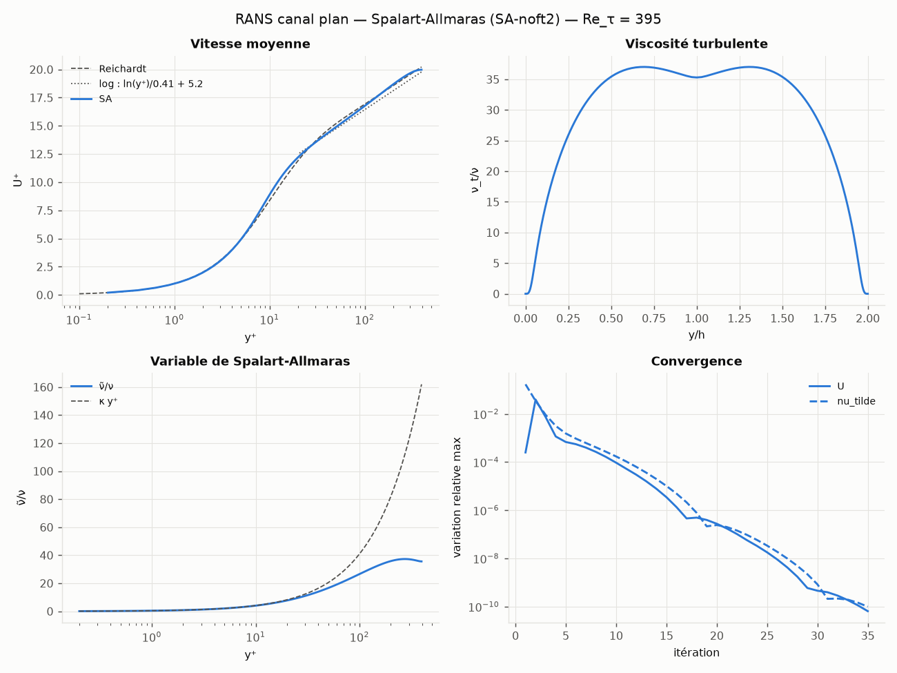
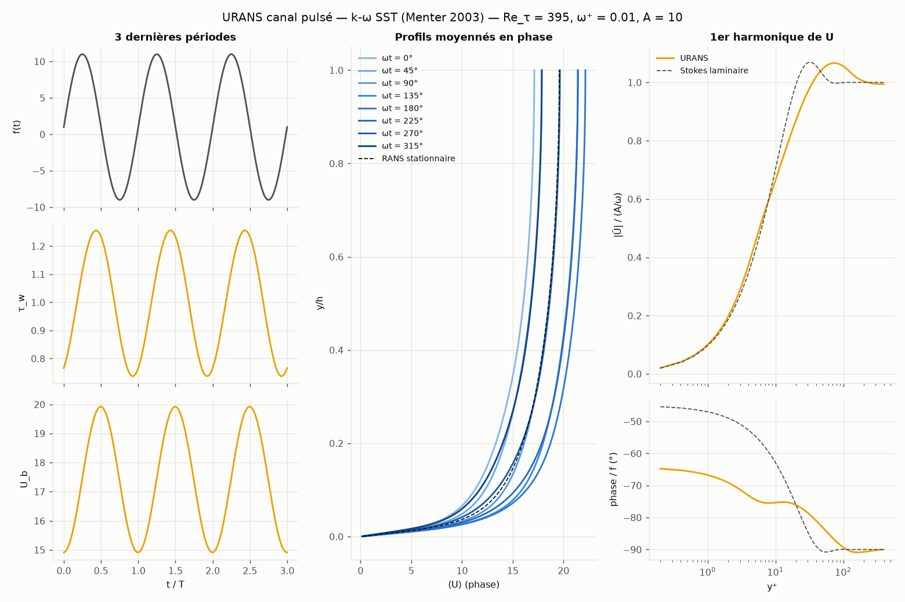

# microrans — micro-solveur RANS / URANS 1D

Petit code Python exécutable pour tester des modèles de turbulence **RANS** (stationnaire) et
**URANS** (instationnaire) sur le cas le plus simple qui ait du sens physiquement : le **canal plan
turbulent pleinement établi**, intégré jusqu'à la paroi.

Modèles disponibles :

| Clé   | Modèle | Variante implémentée | Référence |
|-------|--------|----------------------|-----------|
| `sa`  | Spalart-Allmaras | forme « standard » NASA TMR, **SA-noft2** par défaut (`--sa-ft2` pour activer f_t2), limitation de S̃ (note c) | Spalart & Allmaras 1992 ; [TMR](https://turbmodels.larc.nasa.gov/spalart.html) |
| `ke`  | k-ε | **Launder-Sharma bas-Reynolds** (fonctions d'amortissement, intégrable jusqu'à la paroi) | Launder & Sharma 1974 ; [TMR](https://turbmodels.larc.nasa.gov/ke-ls.html) |
| `kw`  | k-ω | **Wilcox 2006** (limiteur de contrainte, diffusion croisée) | Wilcox 2006/2008 ; [TMR](https://turbmodels.larc.nasa.gov/wilcox.html) |
| `sst` | k-ω SST | **Menter 2003** | Menter, Kuntz & Langtry 2003 ; [TMR](https://turbmodels.larc.nasa.gov/sst.html) |
| `laminar` | aucun (ν_t = 0) | sert à la vérification | — |

> **Ce que c'est :** un banc d'essai minimal, vérifié, rapide (< 0.5 s par calcul RANS), pour
> comprendre et comparer les modèles, et une base propre à étendre.
>
> **Ce que ce n'est pas :** un code CFD général. C'est du **1D** (U = U(y, t)) : pas de convection,
> pas de décollement, pas de lâcher tourbillonnaire. L'« URANS » est ici un canal à **gradient de
> pression pulsé** (instationnarité imposée), pas une instationnarité auto-entretenue comme un
> sillage de cylindre — ce qui demanderait au minimum un solveur 2D.

---

## Installation

```bash
pip install -e ".[test]"        # ou : pip install -r requirements.txt
```

Python ≥ 3.10, dépendances : numpy, scipy, matplotlib (pytest pour les tests).

## Utilisation

```bash
# RANS stationnaire, un ou plusieurs modèles (all = sa ke kw sst)
python -m microrans rans -m all                       # Re_τ = 395 par défaut
python -m microrans rans -m sst --re-tau 5200 -o results/sst5200
python -m microrans rans -m sa kw --reference dns_Up.dat   # superpose un profil (y+, U+)

# URANS : canal pulsé f(t) = 1 + A sin(ωt)
python -m microrans urans -m all                      # ω+ = 0.01, A = 10
python -m microrans urans -m kw --omega-plus 0.04 --amplitude 40 --scheme bdf2

# Vérification du code contre des solutions exactes
python -m microrans verify
```

`python -m microrans rans -h` / `urans -h` liste toutes les options (maillage `--n-cells`,
`--y1plus`, pas de temps, tolérances…). Une fois installé, la commande `microrans` est équivalente.

### Sorties

Pour chaque modèle, dans `<out>/<modèle>/` :

| RANS | URANS |
|------|-------|
| `summary.json` (U_b⁺, U_c⁺, C_f, écart à Dean, résidu, temps…) | `summary.json` (⟨τ_w⟩, amplitude/phase de τ_w et U_b, périodicité…) |
| `profiles.csv` (y, y⁺, U, U⁺, ν_t/ν, variables de turbulence) | `history.csv` (t, f, τ_w, U_b, U_c, sous-itérations) |
| `residuals.csv` | `phase_profiles.csv`, `harmonic.csv` (1er harmonique vs Stokes laminaire) |
| `rans_<modèle>.png` | `urans_<modèle>.png`, `final_profiles.csv` |

Avec plusieurs modèles : `<out>/summary.csv` et `<out>/comparison.png`.

---

## Physique

Canal plan de demi-hauteur h, parois en y = 0 et y = 2h, écoulement établi :

```
∂U/∂t = f(t) + ∂/∂y[(ν + ν_t) ∂U/∂y],     f = −(1/ρ) ∂p/∂x
```

**Adimensionnement :** longueurs en h, vitesses en u_τ nominale (f moyen = u_τ²/h = 1), temps en
h/u_τ, donc ν = 1/Re_τ. En stationnaire, le bilan de quantité de mouvement impose exactement
τ_w = f·h = 1 : c'est un contrôle de convergence intégré.

**Conditions aux limites :** U = 0, k = 0, ν̃ = 0, ε̃ = 0 aux parois ; ω_paroi = 10·6ν/(β Δy₁²)
(Menter). Tout est résolu jusqu'à la paroi (pas de loi de paroi) : il faut y1⁺ < 1.

**Cas URANS :** f(t) = 1 + A sin(ωt), ω = ω⁺ Re_τ. Le calcul part de la solution RANS, avance
sur ~80 h/u_τ de transitoire (le débit relaxe avec une constante de temps ≈ 6 h/u_τ), puis fait des
moyennes de phase et extrait le 1er harmonique sur les dernières périodes. Référence analytique
superposée : la couche de Stokes laminaire soumise au même forçage.

## Numérique

- **Espace :** volumes finis centrés aux noeuds, maillage en tanh resserré aux deux parois
  (y1⁺ imposé), diffusivités moyennées aux faces, ordre 2 (vérifié).
- **Termes sources :** linéarisation de **Newton** (jacobienne locale sur la diagonale, partie
  explicite ≥ 0). C'est indispensable : une linéarisation « Picard » des puits quadratiques
  (βω², C₂ε̃²/k, c_w1 f_w (ν̃/d)²) produit des oscillations de période 2 aux grands pas de temps.
- **RANS :** marche en pseudo-temps (Euler implicite, Δτ = 5 h/u_τ) + **sous-relaxation 0.5** des
  variables de turbulence. Le couplage ségrégué U ↔ ν_t se comporte comme x ↦ a/x (pente −1) ;
  la relaxation ramène la pente à ~0. Testé de Re_τ = 180 à 5200 : les 4 modèles convergent
  jusqu'à la précision machine (variation relative ~1e-13).
- **URANS :** Euler implicite (ordre 1) ou **BDF2** (ordre 2, défaut), sous-itérations de Picard à
  chaque pas avec prédicteur par extrapolation linéaire, tolérance 1e-6.
- Chaque équation est un système tridiagonal (`scipy.linalg.solve_banded`).

---

## Vérification (le code résout-il bien les équations ?)

`python -m microrans verify` — résultats obtenus :

| Cas | Ordre observé | Attendu |
|-----|---------------|---------|
| Diffusion à coefficient variable, solution manufacturée, maillage étiré | 1.99 → 2.00 | 2 |
| Womersley laminaire (solution exacte), temps, Euler implicite | 0.98 → 0.99 | 1 |
| Womersley laminaire, temps, BDF2 | 1.96 → 1.99 | 2 |
| Womersley laminaire, espace | 1.86 → 2.01 | 2 |
| Poiseuille laminaire | erreur 1e-15 (schéma exact pour une parabole) | — |

La suite `pytest` (56 tests, ~16 s) contrôle en plus : convergence et positivité pour les 4
modèles, τ_w = 1, symétrie, sous-couche visqueuse U⁺ = y⁺, ν̃ = κ u_τ y pour SA, pente log 1/κ
pour SA, k = τ(y)/√C_μ dans la zone log pour les modèles à 2 équations, convergence en maillage,
robustesse de Re_τ = 180 à 5200, URANS sans forçage = RANS, bilan ⟨τ_w⟩ = 1 en régime pulsé, CLI.

## Résultats (réglages par défaut : 192 mailles, y1⁺ = 0.2)

### RANS — vitesse débitante U_b⁺

| Modèle | Re_τ = 395 | écart Dean | Re_τ = 5200 | écart Dean | Itérations | Temps |
|--------|-----------:|-----------:|------------:|-----------:|-----------:|------:|
| SA     | 17.63 | +2.5 % | 23.80 | −4.3 % | ~40 | 0.02 s |
| k-ε LS | 18.68 | +8.6 % | 24.55 | −1.2 % | ~800 | 0.3 s |
| k-ω 06 | 17.52 | +1.9 % | 24.34 | −2.1 % | ~90 | 0.05 s |
| SST    | 17.38 | +1.0 % | 23.89 | −3.9 % | ~90 | 0.05 s |

**Attention à l'interprétation :** Dean (1978), C_f = 0.073 Re_b^(−1/4), est une *corrélation
empirique* (précision de quelques %), pas une référence exacte. Ces écarts ne valident ni
n'invalident un modèle. Pour une vraie comparaison, superposer un profil DNS avec `--reference`
(par ex. Lee & Moser 2015, https://turbulence.oden.utexas.edu). Aucune donnée DNS n'est
embarquée dans le dépôt.


Figure produite pour un modèle seul (ici SA : ν̃ = κy⁺ en proche paroi, creux de ν_t au centre) :



### Sensibilité au maillage (U_b⁺ à Re_τ = 395)

| Maillage | SA | k-ε LS | k-ω 06 | SST |
|----------|---:|------:|------:|----:|
| 128 mailles, y1⁺ = 0.5 | 17.608 | 18.483 | 17.670 | 17.521 |
| **192 mailles, y1⁺ = 0.2 (défaut)** | 17.629 | 18.683 | 17.523 | 17.375 |
| 1024 mailles, y1⁺ = 0.05 | 17.649 | 18.804 | 17.437 | 17.291 |

SA est peu sensible. **k-ε Launder-Sharma** est très sensible à y1⁺ (ε̃ et le terme D culminent à
la paroi) ; **k-ω et SST** le sont via la condition pariétale de Menter sur ω (convergence ≈ ordre 1
en y1⁺). Avec les réglages par défaut, l'erreur de maillage sur U_b⁺ est ≤ 0.7 %.

### URANS — canal pulsé (Re_τ = 395, ω⁺ = 0.01, A = 10)

| Modèle | ⟨τ_w⟩ (attendu 1) | amplitude τ̂_w | phase τ_w / forçage | temps |
|--------|------------------:|--------------:|--------------------:|------:|
| SA     | 1.00004 | 0.296 | −67.7° | 8 s |
| k-ε LS | 1.00005 | 0.179 | −62.5° | 25 s |
| k-ω 06 | 1.00004 | 0.277 | −66.5° | 15 s |
| SST    | 1.00003 | 0.259 | −64.3° | 19 s |
| *Stokes laminaire (réf. analytique)* | — | *0.253* | *−45°* | — |

Les modèles donnent des réponses de frottement nettement différentes (±25 %) à forçage identique :
c'est typiquement ce que ce banc d'essai permet d'étudier. Aucune donnée LES/DNS de canal pulsé
n'est incluse pour trancher.




---

## Limites connues (à lire avant d'utiliser les résultats)

1. **1D uniquement** : pas de gradient de pression adverse, de décollement, de courbure, de
   convection. Les écarts entre modèles y sont bien plus grands que dans un canal.
2. **URANS à instationnarité imposée** seulement. Pas de lâcher tourbillonnaire possible en 1D.
3. **k-ε** : seule la variante bas-Reynolds de Launder-Sharma est disponible (pas de k-ε standard
   haut-Reynolds, qui exige des lois de paroi).
4. **k-ω / SST** : la zone log est atteinte lentement (la fonction indicatrice y⁺dU⁺/dy⁺ vaut
   ~2.6–2.8 au lieu de 1/κ ≈ 2.44 à Re_τ = 2000, alors que k⁺ = τ/√β* est bien respecté). C'est le
   comportement de ces modèles sans correction bas-Reynolds, pas un défaut du code à ma connaissance,
   mais ce n'est **pas** vérifié contre une autre implémentation de référence.
5. La cohérence des modèles a été contrôlée par des propriétés analytiques (couche log, sous-couche,
   bilans), **pas** par comparaison point à point avec les solutions de référence du NASA TMR
   (qui portent sur des cas 2D).
6. Le maillage doit résoudre la sous-couche visqueuse (y1⁺ ≲ 0.5, idéalement 0.2).

## Pistes d'amélioration

- Solveur 2D (plaque plane NASA TMR, marche descendante, cylindre en URANS) — le vrai saut.
- Comparaison DNS intégrée (téléchargement des profils Lee & Moser), cas de Couette.
- Autres variantes : k-ω Wilcox 1988, SST-V, SA-neg, SA-RC, k-ε standard + lois de paroi,
  modèles algébriques (Cess, longueur de mélange).
- Solveur couplé (Newton global) pour accélérer k-ε ; pas de pseudo-temps adaptatif.
- Transfert de chaleur (équation de la température, Pr_t).

## Structure du code

```
microrans/
  grid.py            maillage 1D en tanh, y1+ imposé
  numerics.py        dérivées sur maillage non uniforme, solveur tridiagonal implicite
  flow.py            champ U et dérivées, diagnostics pariétaux, champ initial (Cess)
  models/            base.py (interface + linéarisation de Newton), un fichier par modèle
  solver.py          RANS (pseudo-temps) et URANS (Euler / BDF2 + sous-itérations)
  cases.py           cas prêts à l'emploi : canal RANS, canal pulsé URANS
  reference.py       Poiseuille, Womersley, Stokes, loi log, Reichardt, Dean
  verification.py    études d'ordre de convergence
  postprocess.py     CSV / JSON / figures
  cli.py             interface en ligne de commande
tests/               pytest
```

**Ajouter un modèle :** créer une classe dérivée de `TurbulenceModel` (`models/base.py`) qui
définit `variables`, `initial_state`, `eddy_viscosity` et `update` ; dans `update`, écrire chaque
équation comme `∂φ/∂t = Q(φ) + ∂/∂y(Γ ∂φ/∂y)`, passer `Q` et `dQ/dφ` à `linearize_source`, puis
appeler `self._solve(step, nom, Γ, source, puits)`. L'enregistrer dans `MODELS`
(`models/__init__.py`). Le schéma en temps (RANS ou URANS) est géré par le solveur.
