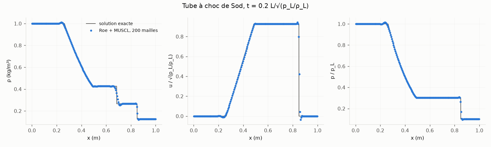
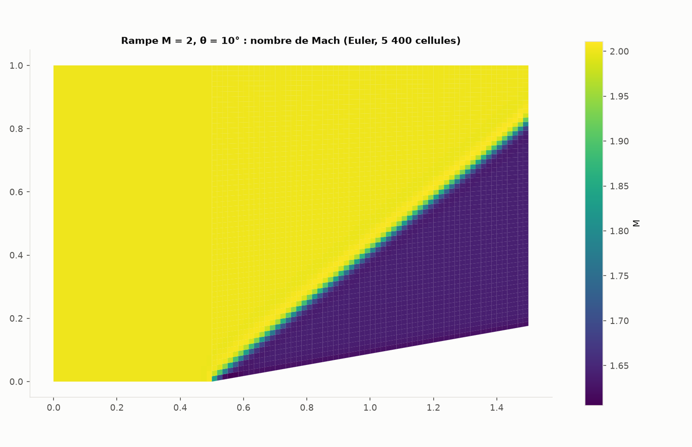
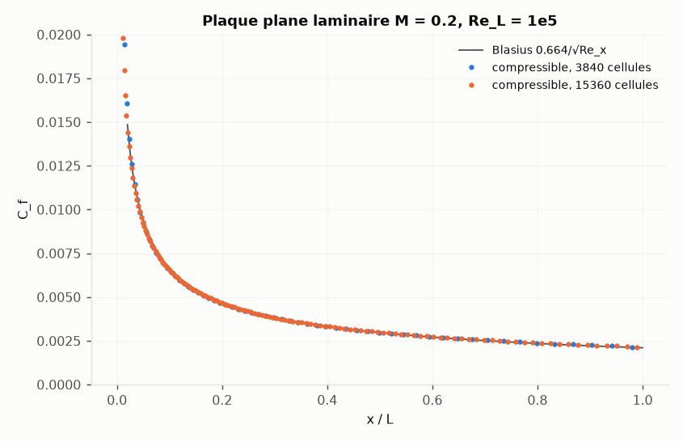
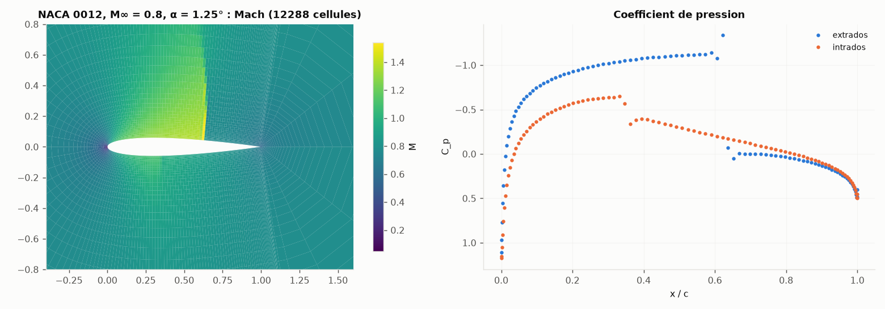

# Écoulements compressibles : solveur en densité (Euler, Navier-Stokes laminaire)

Document technique (le README en reprend l'essentiel). Tous les chiffres ci-dessous ont été
mesurés avec ce code ; les écarts aux références sont donnés tels quels. Tableaux
reproductibles : `python -m microrans.fv2d.compressible_validation --out docs`
(4.5 min sans le NACA, mesuré ; le NACA ajoute ~15 min, estimé d'après les temps
par itération du § 4).

## 1. Ce que c'est, ce que ce n'est pas

- **2D plan**, gaz parfait (γ, R, Pr constants ; air sec par défaut), grandeurs **SI
  dimensionnelles** (Pa, K, kg/m³, m/s). Mêmes maillages que le solveur incompressible
  (structurés, triangles, hybrides, importés, périodicité comprise).
- **Euler** (non visqueux) ou **Navier-Stokes laminaire** (μ constante ou loi de
  Sutherland, conduction de Fourier, dissipation visqueuse).
- Stationnaire (pas de temps local : Runge-Kutta ou **implicite**) et instationnaire
  (Runge-Kutta SSP d'ordre 3, pas global).
- **Pas de turbulence** (ni RANS ni LES) : un écoulement compressible turbulent n'est pas
  calculable. **Pas d'axisymétrique**, **pas de carte graphique** (CPU seulement), pas de
  gaz réel, de combustion, ni de multi-espèces.

Activation : `[physics] compressible = true` ; `run_case` délègue alors tout le calcul à
`fv2d/compressible_case.py`. Mêmes sorties que l'incompressible (`summary.json`,
`history.csv`, `wall_<patch>.csv` avec Cp, C_f, y⁺, T, q ; `fields.vtk` avec ρ, U, p, T,
Mach, Cp, entropie ; figures ; `checkpoint.npz` et reprise exacte ou interpolée).

## 2. Méthodes (et pourquoi)

| Élément | Choix | Référence |
|---|---|---|
| Flux convectifs | Roe (défaut) avec correction d'entropie de Harten (δ = 0.1 c̃) ; HLLC en option | Roe 1981 ; Blazek (2015) éq. 4.89-4.91 ; Toro (2009) § 10.4 |
| Ordre 2 | reconstruction MUSCL des variables primitives, gradient de Green-Gauss | Blazek § 5.3 |
| Limiteur | Venkatakrishnan (seuil ε de Wang : indépendant des unités ; `venkat_k` = 0.05 par défaut, comme SU2, **0.3 pour les profils** : § 3.5), Barth-Jespersen, aucun ; gel optionnel (`limiter_freeze`, **à éviter** : voir § 3.5) | Venkatakrishnan 1995 ; Wang 2000 ; SU2 |
| Flux visqueux | gradient aux faces moyen + correction selon PN | Blazek § 5.4 ; Weiss et al. 1999 |
| Temps (instationnaire) | SSP-RK3, pas global au CFL | Shu & Osher 1988 |
| Stationnaire | pas local ; RK3, RK5 (van Leer, Tai & Powell 1989) ou **implicite** : Euler implicite linéarisé, jacobienne d'ordre 1 (dissipation de Roe exacte), GMRES préconditionné par Gauss-Seidel symétrique par blocs, CFL adaptatif (plafond divisé par 2 seulement si la solution oscille sans converger : § 3.5) | Blazek § 6.2 ; SU2 |
| Conditions | champ lointain (invariants de Riemann) + **correction de tourbillon ponctuel** optionnelle, entrée subsonique (p0, T0, direction), sortie subsonique (p), entrée / sortie supersoniques, paroi glissante, paroi adhérente adiabatique ou isotherme (mobile), symétrie, périodicité | Blazek § 8.4-8.5 ; Thomas & Salas 1986 |

**Correction de tourbillon ponctuel** (`[boundary.<champ lointain>] vortex = [x, y]`, point
d'application, ex. quart de corde) : la vitesse induite par la circulation
Γ = L′/(ρ∞U∞) (portance actuelle des parois, Kutta-Joukowski) est ajoutée à l'état amont
des faces de champ lointain, avec le facteur de Prandtl-Glauert ; pression et masse
volumique suivent à enthalpie totale et entropie amont. Mesuré (NACA 0012, M = 0.5,
α = 1.25°, 64 cellules autour du profil) :

| Distance du champ lointain | 10 cordes | 30 cordes | 100 cordes | écart |
|---|---:|---:|---:|---:|
| C_l sans correction | 0.1590 | 0.1634 | 0.1651 | 3.8 % |
| C_l avec correction | 0.1655 | 0.1657 | 0.1658 | 0.2 % |

## 3. Validation

### 3.1 Tube à choc de Sod (instationnaire, Euler)

Bande de 1 maille d'épaisseur, t = 0.2 L/√(p_L/ρ_L), solution exacte (problème de Riemann,
Toro 2009 chap. 4).

| Flux | Mailles | L1(ρ) | L1(u)/a | L1(p)/p_L | choc (exact 0.8504) | contact (0.6855) | milieu de détente (0.3747) | masse |
|---|---:|---:|---:|---:|---:|---:|---:|---:|
| Roe | 100 | 6.03e-3 | 1.07e-2 | 4.67e-3 | 0.8514 | 0.6848 | 0.3771 | −9e-10 |
| Roe | 200 | 3.33e-3 | 5.49e-3 | 2.41e-3 | 0.8510 | 0.6858 | 0.3759 | −1e-14 |
| Roe | 400 | 1.92e-3 | 2.90e-3 | 1.26e-3 | 0.8508 | 0.6861 | 0.3753 | −2e-14 |
| HLLC | 100 | 6.32e-3 | 1.12e-2 | 4.90e-3 | 0.8515 | 0.6845 | 0.3769 | −8e-10 |
| HLLC | 200 | 3.48e-3 | 5.74e-3 | 2.54e-3 | 0.8510 | 0.6856 | 0.3758 | −1e-14 |
| HLLC | 400 | 1.99e-3 | 3.02e-3 | 1.32e-3 | 0.8507 | 0.6860 | 0.3752 | −2e-14 |

Ordre observé en L1(ρ) : 0.86 puis 0.80 — attendu inférieur à 1 avec des discontinuités
(l'ordre 2 ne vaut que dans les zones régulières). Roe est un peu plus précis que HLLC.
Petit dépassement (~1 %) en tête et en queue de détente (limiteur de Venkatakrishnan,
qui n'est pas strictement monotone).

### 3.2 Rampe de compression supersonique (stationnaire, Euler)

M = 2, θ = 10°, théorie du choc oblique (NACA Report 1135) : β = 39.31°, p2/p1 = 1.7066,
M2 = 1.6405.

| Cellules | β | p2/p1 | M2 | C_d de la rampe (exact 0.0445) | Itérations (implicite) |
|---:|---:|---:|---:|---:|---:|
| 1 350 | 39.28° | 1.708 | 1.639 | 0.04449 | 55 |
| 5 400 | 39.33° | 1.707 | 1.640 | 0.04449 | 70 |
| 21 600 | 39.30° | 1.707 | 1.640 | 0.04450 | 87 |

### 3.3 Plaque plane laminaire (Navier-Stokes)

M = 0.2, Re_L = 1e5, paroi adiabatique ; Blasius C_f = 0.664/√Re_x (effet de
compressibilité < 1 % à ce Mach).

| Cellules | C_d (Blasius 0.00420) | écart C_f x = 0.1 | 0.4 | 0.8 | 0.95 | écart moyen (0.1 < x < 0.95) |
|---:|---:|---:|---:|---:|---:|---:|
| 3 840 | 0.004236 | −2.0 % | −0.3 % | +1.3 % | +1.8 % | 1.0 % |
| 15 360 | 0.004231 | −1.4 % | +0.1 % | +1.7 % | +2.7 % | 0.8 % |

L'écart près du bord de fuite (+2.7 %) **ne diminue pas** avec le maillage : c'est la
sortie à pression imposée placée au bord de fuite (x = 1), qui perturbe la couche limite
sur les derniers pourcents ; il faudrait prolonger le domaine en aval.

### 3.4 Écoulement de Couette avec dissipation visqueuse

μ constante, parois isothermes, T = T_w + Pr U²/(2c_p) η(1 − η) (White, « Viscous Fluid
Flow », § 3-2) : vitesse exacte à 1e-8, température à 0.2 % de ΔT_max, frottement et flux
de chaleur pariétaux à 3e-8 (201 itérations implicites, 0.8 s).

### 3.5 Profil NACA 0012 (Euler)

Profil **fermé** (coefficient −0.1036 au lieu de −0.1015 de l'équation NACA : définition
des workshops « High-Order CFD », `trailing_edge = "closed"`, défaut), maillage en O,
champ lointain à 30 cordes avec correction de tourbillon, Roe + MUSCL + Venkatakrishnan
**K = 0.3** (limiteur non gelé ; pourquoi K = 0.3 : plus bas), schéma implicite ; hauteur
de 1re maille 2e-3 × 192 / n_autour. Tous les calculs ci-dessous sont convergés (résidus
relatifs < 1e-8).

**M = 0.8, α = 1.25°** (transsonique : choc à l'extrados vers x = 0.63, choc faible à
l'intrados vers x = 0.35)

| Maillage | Cellules | C_l | C_d | C_m (¼ de corde, cabreur > 0) | Itérations |
|---|---:|---:|---:|---:|---:|
| 96 × 32 | 3 072 | 0.3308 | 0.02258 | −0.0329 | 274 |
| 192 × 64 | 12 288 | 0.3337 | 0.02190 | −0.0335 | 452 |
| 384 × 128 | 49 152 | 0.3333 | 0.02178 | −0.0334 | 868 |
| même maillage, sans limiteur | 49 152 | 0.3330 | 0.02176 | −0.0333 | 925 |
| référence, même géométrie (voir ci-dessous) | | 0.333 | 0.02135 | | |

**C_l à +0.1 % de la référence, C_d à +2 %** (384 × 128). Référence : Galerkin discontinu hp-adaptatif
orienté objectif (Dolejší & Roskovec, Commun. Appl. Math. Comput. 2021, arXiv 2007.06840),
C_l = 0.333, C_d = 0.02135 ; **valeurs lues dans un résumé de moteur de recherche,
l'article lui-même n'a pas pu être ouvert** depuis la machine de développement (accès
réseau filtré), ni sa définition exacte du profil (le profil fermé −0.1036 est celui du
cas « NACA 0012 transsonique » des workshops High-Order CFD, dont ces auteurs sont des
participants). **L'écart de C_d (+0.0004) n'est pas expliqué** : la traînée parasite
mesurée en subsonique sur le même maillage (ci-dessous : 0.00013 à 384 × 128) n'en couvre
qu'un tiers. Constaté : une couche d'entropie parasite dans la 1re maille le long de la
paroi, créée au bord d'attaque (192 × 64 : écart d'entropie 6.3e-3 dans la 1re maille
avec K = 0.05, 3.8e-3 sans limiteur ; 4e-4 à 7e-4 dans la 2e maille, < 3e-5 à 0.02 corde
de la paroi ; nul en amont, < 3e-8).

**L'« écart de 4.5 % » des versions précédentes de ce document est expliqué** (lot #30,
2026-10-03). Il additionnait deux erreurs de comparaison, aucune dans le solveur :

1. **Valeur de comparaison d'une autre géométrie.** « ≈ 0.35 » est la valeur courante
   du profil à **bord de fuite ouvert** (équation d'origine, épaisseur 0.25 % de corde au
   bord de fuite ; cas AGARD-AR-211, 1985). La définition du bord de fuite pèse lourd en
   transsonique ; mesuré avec ce code, même maillage, mêmes réglages :

   | Bord de fuite (`trailing_edge`) | t/c | 192 × 64 : C_l ; C_d | 384 × 128 : C_l ; C_d |
   |---|---:|---:|---:|
   | `closed` (−0.1036, défaut) | 12.00 % | 0.3337 ; 0.02190 | 0.3333 ; 0.02178 |
   | `sharp` (équation d'origine prolongée jusqu'à épaisseur nulle, x = 1.00893, puis ramenée à la corde : Vassberg & Jameson 2010) | 11.90 % | 0.3343 ; 0.02172 | 0.3340 ; 0.02161 |
   | `open` (équation d'origine, AGARD) | 12.00 % | 0.3460 ; 0.02370 | 0.3477 ; 0.02367 |

   Le bord de fuite ouvert donne **+3.7 à +4.3 %** de C_l (0.348 sur 384 × 128, proche du
   « ≈ 0.35 » courant) : c'est l'essentiel de l'ancien écart.
2. **Seuil du limiteur trop bas dans l'exemple (K = 0.05, défaut du solveur, celui de
   SU2).** Le limiteur de Venkatakrishnan agit alors aussi hors du choc (bord d'attaque,
   bord de fuite) ; l'effet dépend du maillage et de la géométrie, et le système discret
   admet plusieurs solutions stationnaires :

   | Maillage, grandeur | K = 0.05 | 0.1 | 0.15 | 0.3 | 1 | sans limiteur |
   |---|---:|---:|---:|---:|---:|---:|
   | 96 × 32, implicite : C_l | 0.3139 | 0.3267 | 0.3294 | 0.3308 | 0.3308 | 0.3308 |
   | 96 × 32, RK3 : C_l | **0.3162** | 0.3267 | 0.3294 | 0.3308 | 0.3308 | 0.3308 |
   | 192 × 64 : C_l | 0.3353 | 0.3348 | 0.3343 | 0.3337 | 0.3333 | 0.3332 |
   | 192 × 64 : dépassement de C_p au choc | 0.04 | 0.10 | 0.15 | 0.23 | 0.28 | 0.29 |
   | 384 × 128 : C_l | 0.3345 | | | 0.3333 | | 0.3330 |
   | 384 × 128 : dépassement de C_p au choc | 0.05 | | | 0.19 | | 0.22 |
   | 192 × 64, profil `sharp` : C_l | 0.3280 | | | 0.3343 | | |
   | 384 × 128, profil `sharp` : C_l (itérations) | 0.3315 (4 579) | | | 0.3340 (876) | | |

   Dépassement : C_p minimal juste avant le choc d'extrados moins le plateau
   (0.45 < x < 0.52, C_p = −1.104 dans tous les cas) ; 0.04-0.05 est l'accélération réelle
   avant le choc, le reste est une oscillation d'une maille (visible sur la figure
   ci-dessus).

   Avec K = 0.05, implicite et RK3 convergent (résidus < 1e-8) vers **deux solutions
   différentes** (0.3139 et 0.3162) ; avec K ≥ 0.1 ou sans limiteur, les deux schémas
   redonnent la même solution à 1e-5 près. K = 0.05 abaissait aussi C_l de 5 % sur
   96 × 32, faisait croire à un effet du bord de fuite pointu (−2.2 % au lieu de +0.2 %)
   et demande deux fois plus d'itérations (192 × 64 : 1 011 au lieu de 452).
   **C'est un compromis** : plus K est petit, plus le choc est net,
   mais plus C_l est biaisé sur maillage grossier. L'exemple utilise `venkat_k = 0.3`
   (C_l à moins de 0.15 % de la solution sans limiteur sur les trois maillages ; une
   maille en dépassement au choc) ; pour un choc sans dépassement visible, K = 0.1 (C_l −1.2 % sur
   96 × 32, +0.5 % sur 192 × 64). Le défaut du solveur reste 0.05 (cas validés à chocs
   forts : rampe M = 2, tube de Sod, non remesurés avec 0.3).

**Non résolu : la valeur de Vassberg & Jameson (2010)** pour le profil `sharp`. Un extrait
de recherche cite « C_L ≈ 0.347 » et « C_D = 0.022453440 » (convergé en maillage) ; ce
code donne 0.3340 (−3.7 %). Mais les deux références citées ici (0.333 pour `closed`,
≈ 0.347 pour `sharp`) diffèrent de 4 % alors que ces deux géométries ne diffèrent que de
0.2 % ici : l'une des deux valeurs, telle que citée, est fausse ou porte sur d'autres
conditions. Les articles n'ont pas pu être lus pour trancher.

Autres pistes mesurées (192 × 64, K = 0.05 sauf mention ; écart relatif de C_l) :

| Variante | C_l | C_d | écart |
|---|---:|---:|---:|
| réglages de l'ancien exemple (Roe, correction d'entropie 0.1, K = 0.05, 30 cordes) | 0.3353 | 0.02208 | — |
| champ lointain à 100 cordes (72 mailles radiales) | 0.3355 | 0.02216 | +0.06 % |
| flux HLLC | 0.3352 | 0.02208 | −0.03 % |
| sans correction d'entropie | 0.3351 | 0.02207 | −0.06 % |
| 128 mailles radiales au lieu de 64 (profil `sharp`) | 0.3279 | 0.02143 | −0.04 % |
| valeur de paroi des gradients extrapolée (au lieu de ∂p/∂n ≈ 0 dans les cellules de paroi ; essai, non retenu) | 0.3362 | 0.02211 | +0.25 % |

**M = 0.5, α = 1.25°** (subsonique : traînée nulle en Euler, toute traînée calculée est
une erreur numérique)

| Maillage | Cellules | C_l (K = 0.3) | C_d (exact : 0) | C_l (K = 0.05) | C_d (K = 0.05) | C_l (sans limiteur) |
|---|---:|---:|---:|---:|---:|---:|
| 96 × 32 | 3 072 | 0.1723 | 0.00199 | 0.1715 | 0.00277 | 0.1729 |
| 192 × 64 | 12 288 | 0.1778 | 0.00035 | 0.1771 | 0.00055 | 0.1779 |
| 384 × 128 | 49 152 | 0.1794 | 0.00013 | 0.1791 | 0.00017 | 0.1794 |

Même en écoulement régulier, K = 0.05 limite au bord d'attaque : C_l −0.2 à −0.5 % et
traînée parasite +39 % (96 × 32), +57 % (192 × 64), +31 % (384 × 128) par rapport à
K = 0.3 ; K = 0.3 et « sans limiteur » coïncident à 384 × 128. Contrôle indépendant du C_l
subsonique : méthode des panneaux (Hess-Smith, vérifiée sur des profils de Joukowski et de
Kármán-Trefftz à solution exacte) sur le même profil : C_l incompressible = 0.15093 ; à
M = 0.5, Prandtl-Glauert 0.1743, Kármán-Tsien (appliqué aux C_p) 0.1821 : la valeur
calculée (≈ 0.180) est dans cet intervalle, trop large pour une vérification plus fine.

**Convergence : deux pièges, corrigés** (mesurés sur 192 × 64, M = 0.8, avec l'ancien
seuil K = 0.05) :

1. **Limiteur gelé trop tôt = solution fausse.** Avec `limiter_freeze = 200` (ancien
   réglage de l'exemple), le limiteur est figé alors que le choc n'est pas encore en place
   (C_l = 0.296 à l'itération 200) : les résidus tombent ensuite à 1e-10, mais vers
   **C_l = 0.3238 (−3.4 %)**. Le limiteur de Venkatakrishnan converge ici sans être gelé ;
   ne geler (`limiter_freeze`) que si les résidus cyclent, et seulement une fois les
   efforts stabilisés.
2. **Plafond de CFL réduit pendant le démarrage.** Le schéma implicite divisait le
   plafond de CFL par 2 dès que les résidus stagnaient 25 itérations — ce qui arrive
   normalement au démarrage, pendant que le choc se déplace. Le CFL tombait à 6.25 et
   n'en remontait pas : pas de convergence en 3 000 itérations. Le plafond n'est plus
   réduit que si la solution **oscille** pendant la stagnation :
   ‖Q_n − Q_début‖ / Σ‖ΔQ_k‖ < 0.2 (mesuré : 0.38 à 0.92 aux stagnations du démarrage,
   0.03 à 0.11 dans le vrai cycle limite à CFL 100 ; seuil calibré sur ce cas et sur la
   plaque plane seulement). `cfl_cuts = 0` supprime toute réduction.

| Pilotage du CFL (limiteur non gelé) | C_l à ±0.001 dès l'itération | résidus < 1e-6 dès |
|---|---:|---:|
| ancienne règle, plafond 50 (réduit à 6.25) | non atteint en 1 500 | non atteint en 1 500 |
| CFL fixe 25 | 690 | non atteint en 1 000 (3e-6) |
| CFL fixe 50 | 390 | 630 |
| CFL fixe 100 | 250 | jamais (cycle limite, ~3e-3) |
| **nouvelle règle, plafond 100 (exemple)** | **250** | **510** |

Test de non-régression : `test_implicit_cfl_cap_kept_during_transonic_startup` (échoue
avec l'ancienne règle : 2 réductions en 120 itérations).

## 4. Performances (un cœur)

Machine de développement (4 cœurs logiques Intel Xeon 2.1 GHz virtualisés), un seul
calcul à la fois ; mémoire = maximum résident du processus (Python et bibliothèques
compris, ~120 Mo).

| Cas | Cellules | Schéma | ms / itération | µs / itération / cellule | Mémoire |
|---|---:|---|---:|---:|---:|
| NACA 0012 (Euler) | 3 072 | implicite | 23.8 | 7.7 | 144 Mo |
| NACA 0012 (Euler) | 12 288 | implicite | 98.7 | 8.0 | 200 Mo |
| NACA 0012 (Euler) | 49 152 | implicite | 449 | 9.1 | 422 Mo |
| NACA 0012 (Euler) | 12 288 | RK3 (pas local) | 44.2 | 3.6 | 151 Mo |
| Plaque plane (Navier-Stokes) | 3 840 | implicite | 34.9 | 9.1 | 149 Mo |
| Plaque plane (Navier-Stokes) | 3 840 | RK3 (pas local) | 19.3 | 5.0 | 131 Mo |

Une itération implicite coûte ~2 itérations RK3 (assemblage de la jacobienne, GMRES),
mais il en faut beaucoup moins : NACA 96 × 32 convergé (résidus < 1e-6) en 213
itérations implicites (~5 s) contre 16 136 itérations RK3 (177 s, mesuré avec un autre
calcul en parallèle ; ancien seuil `venkat_k` = 0.05). Durées totales de l'exemple
(implicite, `venkat_k` = 0.3, résidus < 1e-8, machine libre, 2026-10-03) : 50 s pour
12 288 cellules (452 itérations ; 112 s et 1 011 itérations avec l'ancien seuil 0.05, même
jour), 6 min 50 s pour 49 152 cellules (868 itérations ; ~13 min avant).

## 5. Limites

1. **Pas de turbulence** (ni RANS ni LES), **pas d'axisymétrique**, **CPU seulement**,
   gaz parfait. Un écoulement compressible turbulent (profil à Reynolds de vol, tuyère
   réelle) n'est pas calculable.
2. **Transsonique (NACA 0012, M = 0.8)** : C_l à +0.1 % et C_d à +2 % d'une référence
   publiée pour le même profil, **lue seulement dans un résumé** ; une autre valeur citée
   (Vassberg & Jameson, bord de fuite pointu, ≈ 0.347) est 3.7 % au-dessus de ce code et
   n'a pas pu être vérifiée (§ 3.5). Chocs vers x = 0.63 (extrados) et 0.35 (intrados),
   comme dans la littérature (≈ 0.6 et ≈ 0.35) ; forme de C_p non comparée point par point.
   Le résultat dépend de la définition du bord de fuite (ouvert : +4 %) et du seuil du
   limiteur (`venkat_k` 0.05 : jusqu'à −5 % sur maillage grossier).
3. **`limiter_freeze`** : un gel avant que la solution soit établie donne une solution
   convergée mais fausse, sans que les résidus le signalent (§ 3.5).
4. **Pilotage du CFL implicite** calibré sur deux cas (NACA transsonique, plaque plane).
   Si les résidus cyclent : baisser `cfl_max` ; `cfl_cuts` règle le nombre de réductions
   automatiques.
5. **Plaque plane** : C_f +2.7 % près du bord de fuite, qui ne diminue pas avec le maillage
   (sortie placée au bord de fuite, § 3.3).
6. **Bas Mach** : flux de Roe / HLLC sans préconditionnement. Mesuré correct à M = 0.2
   (plaque plane) ; plus bas, non mesuré — la littérature (Guillard & Viozat 1999)
   montre une perte de précision quand M → 0. En dessous de M ≈ 0.3, le solveur
   incompressible est le bon outil.
7. **Coût** : ~8-9 µs par itération et par cellule en implicite ; au-delà de ~50 000
   cellules, compter plus de 10 minutes par calcul stationnaire.
8. **Solution stationnaire pas toujours unique avec un seuil de limiteur bas** :
   `venkat_k = 0.05` (défaut) : implicite et RK3 convergent vers deux solutions distantes
   de 0.7 % en C_l (NACA 96 × 32) ; avec 0.3 (exemple NACA) ou sans limiteur, une seule
   solution (§ 3.5). Le défaut n'a pas été changé : les cas à chocs forts (rampe M = 2,
   Sod) n'ont pas été remesurés avec 0.3.
9. **Couverture de la validation** : pas de cas visqueux avec choc (interaction choc /
   couche limite), un seul cas instationnaire (Sod).
